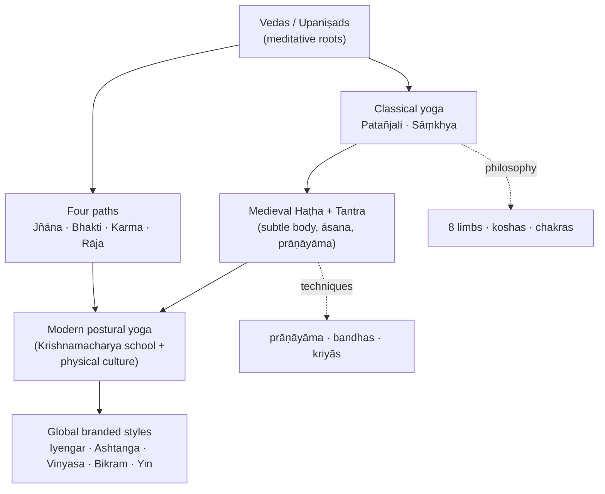

# 🧘 Yoga — Overview & Scope Map

Ask a hundred people what yoga is and you will get a hundred answers: a mat unrolled
before sunrise, a posture held until the legs shake, a way of breathing, a path to
something quieter than the everyday mind. All of them are right, and all of them are
incomplete — because the word has been carrying different freight for the better part of
two and a half thousand years. *Yoga* comes from the Sanskrit *yuj*, "to yoke" or "to
unite," the same root that gives English its "yoke," and from the beginning it named less
a workout than a binding-together: of breath and attention, of self and something larger.

This atlas is an attempt to hold the whole sprawling thing in view at once. Yoga is a
**soteriology** — a family of philosophies built around liberation (*mokṣa*, *kaivalya*).
It is a living **set of traditions and lineages**, passed teacher to student down the
centuries. And it is a **modern, global practice**, the posture- and wellness-centred
activity that most people now picture when they hear the word. These three are tangled
together, and much of the pleasure of the subject lies in pulling the threads apart.

If you take one idea away from this front page, let it be this honest distinction, because
it reorganises everything else. The yoga of the old texts was overwhelmingly meditative,
ascetic, and aimed at release from the cycle of rebirth; physical postures were a small
and late part of the story. The yoga that fills studios today — flowing sequences of
*āsana*, breath, and the language of wellbeing — is a genuinely modern creation. Scholars
such as [[Key-Figures|Mark Singleton]] and James Mallinson have shown that it
was substantially reshaped in the late nineteenth and early twentieth centuries, where
Indian nationalism met European physical culture and gymnastics
([Mark Singleton — Wikipedia](https://en.wikipedia.org/wiki/Mark_Singleton_(yoga_scholar))).
None of this makes modern yoga less real or less valuable. It simply means that "ancient"
and "postural" are not the same claim — and once you see the seam, you start to see how
the whole inheritance was assembled.

## The shape of the inheritance

How did meditative roots become a global movement? The short answer is the long story of
how this happened, told in [[History-and-Origins|the history]]: from the
contested Indus-valley evidence, through the Vedas and Upaniṣads, to Patañjali's classical
synthesis, the medieval flowering of Haṭha and Tantra, and finally the transnational yoga
of the last century. The map below traces that current — how each layer fed the next, and
how the philosophy and the techniques branch off along the way.

Each of those boxes opens onto its own room in the atlas, and you can wander in whatever
order calls to you. If the philosophy draws you, [[Philosophy-and-Concepts|the
concepts]] lay out the eight limbs, the Sāṃkhya metaphysics underneath them, and the
koshas and chakras of the subtle body. If you would rather start from the temperament that
fits you — knowledge, devotion, action, or disciplined practice —
[[Paths-and-Lineages|the four classical paths]] and the schools that descend
from them are the place to begin. The words themselves live in
[[Foundational-Texts|the foundational texts]], from the Vedas and the Bhagavad
Gītā to Patañjali's Yoga Sūtras and the Haṭha corpus, and the people who wrote, embodied,
and reinvented them — Patañjali and the Nāth yogins through Vivekānanda and Krishnamacharya
— gather in [[Key-Figures|the key figures]].

From there the trail comes forward into the body and the present day. The
[[Asana-Catalogue|asana catalogue]] walks through the posture repertoire while
keeping faith with the central distinction — flagging which shapes are genuinely old and
which are twentieth-century inventions — and [[Practices|the practices]]
cover what surrounds the postures: prāṇāyāma, the bandhas and mudrās, the cleansing
ṣaṭkarmas, and meditation. Finally, [[Modern-Styles|the modern styles]] follow
the tradition out into the world and into the branded systems — Iyengar, Ashtanga,
Vinyasa, Bikram, Yin — that now carry it, and [[Open-Media|the open-media
library]] gathers the public-domain and Creative-Commons images and film that let you see
all of it.

If you prefer a flat index to a guided walk, here is the same set of rooms as a single
table:

| Axis | Note | One-line orientation |
|---|---|---|
| **History** | [[History-and-Origins]] | Indus debates → Vedas/Upaniṣads → classical (Patañjali) → medieval Haṭha/Tantra → modern transnational yoga. |
| **Paths & lineages** | [[Paths-and-Lineages]] | The classical paths (Jñāna, Bhakti, Karma, Rāja/Haṭha) and the modern schools that descend from them. |
| **Texts** | [[Foundational-Texts]] | Vedas, Upaniṣads, Gītā, Yoga Sūtras, and the Haṭha corpus (HYP, Gheraṇḍa, Śiva Saṃhitā). |
| **Figures** | [[Key-Figures]] | Patañjali and the Nāths through Vivekānanda, Krishnamacharya and his students. |
| **Asanas** | [[Asana-Catalogue]] | The posture repertoire — and which postures are genuinely old vs 20th-c. inventions. |
| **Practices** | [[Practices]] | Prāṇāyāma, bandhas, mudrās, the ṣaṭkarmas, meditation, and the subtle body. |
| **Philosophy** | [[Philosophy-and-Concepts]] | Eight limbs, Sāṃkhya metaphysics, the koshas and chakras. |
| **Modern styles** | [[Modern-Styles]] | The global spread and the branded styles (Iyengar, Ashtanga, Vinyasa, Bikram, Yin…). |
| **Open media** | [[Open-Media]] | A sourced library of Public-Domain / Creative-Commons images and video. |

Wherever you enter, the through-line holds: a discipline that began as a way of yoking the
restless mind, carried forward by named people in particular places, and still being
remade in our own time. Follow whichever thread pulls hardest.

## Sources
- [Yoga — Wikipedia](https://en.wikipedia.org/wiki/Yoga)
- [Mark Singleton (yoga scholar) — Wikipedia](https://en.wikipedia.org/wiki/Mark_Singleton_(yoga_scholar))
- [The Origins of Yoga — Yoga Journal](https://www.yogajournal.com/yoga-101/philosophy/yoga-s-greater-truth/)
- [History of Yoga — Yoga Basics](https://www.yogabasics.com/learn/history-of-yoga/)
