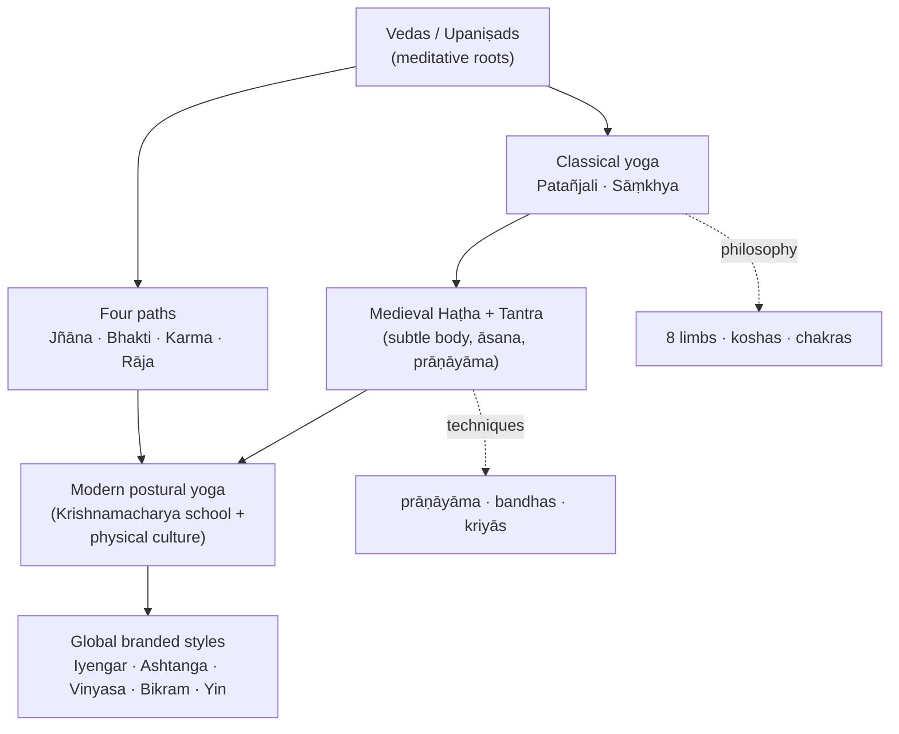

# 🧘 Yoga — Overview & Scope Map

**Yoga** (Sanskrit *yuj*, "to yoke / unite") is a family of physical, mental and
spiritual disciplines that originated on the Indian subcontinent. The word covers at
least three overlapping things that this atlas keeps distinct:

1. a **soteriology** — a set of philosophies aimed at liberation (*mokṣa* / *kaivalya*);
2. a **family of traditions and lineages** transmitted teacher-to-student over ~2,500 years;
3. a **modern transnational practice** — the global, largely posture- and wellness-centred
   activity that most people today mean by "yoga".

A central thread running through the atlas is the scholarly distinction between
**pre-modern yoga** (meditative, ascetic, soteriological) and **modern postural yoga**,
which scholars such as [[Key-Figures|Mark Singleton]] and James Mallinson argue was
substantially reshaped in the late-19th/early-20th century by Indian nationalism and
European physical culture. ([Mark Singleton — Wikipedia](https://en.wikipedia.org/wiki/Mark_Singleton_(yoga_scholar)))

## The axes of the atlas

| Axis | Note | One-line orientation |
|---|---|---|
| **History** | [[History-and-Origins]] | Indus debates → Vedas/Upaniṣads → classical (Patañjali) → medieval Haṭha/Tantra → modern transnational yoga. |
| **Paths & lineages** | [[Paths-and-Lineages]] | The classical paths (Jñāna, Bhakti, Karma, Rāja/Haṭha) and the modern schools that descend from them. |
| **Texts** | [[Foundational-Texts]] | Vedas, Upaniṣads, Gītā, Yoga Sūtras, and the Haṭha corpus (HYP, Gheraṇḍa, Śiva Saṃhitā). |
| **Figures** | [[Key-Figures]] | Patañjali and the Nāths through Vivekānanda, Krishnamacharya and his students. |
| **Asanas** | [[Asana-Catalogue]] | The posture repertoire — and which postures are genuinely old vs 20th-c. inventions. |
| **Practices** | [[Practices]] | Prāṇāyāma, bandhas, mudrās, the ṣaṭkarmas, meditation, and the subtle body. |
| **Philosophy** | [[Philosophy-and-Concepts]] | Eight limbs, Sāṃkhya metaphysics, the koshas and chakras. |
| **Modern styles** | [[Modern-Styles]] | The global spread and the branded styles (Iyengar, Ashtanga, Vinyasa, Bikram, Yin…). |
| **Open media** | [[Open-Media]] | A sourced library of Public-Domain / Creative-Commons images and video. |

## How it fits together

## Sources
- [Yoga — Wikipedia](https://en.wikipedia.org/wiki/Yoga)
- [Mark Singleton (yoga scholar) — Wikipedia](https://en.wikipedia.org/wiki/Mark_Singleton_(yoga_scholar))
- [The Origins of Yoga — Yoga Journal](https://www.yogajournal.com/yoga-101/philosophy/yoga-s-greater-truth/)
- [History of Yoga — Yoga Basics](https://www.yogabasics.com/learn/history-of-yoga/)
