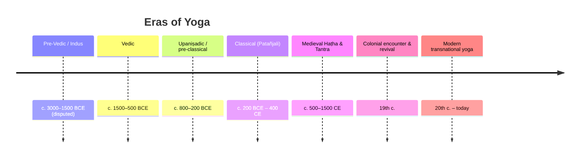

# 📜 History & Origins of Yoga

Walk into almost any studio and you will be told, sooner or later, that you are
joining a 5,000-year-old unbroken tradition — a single thread of practice handed
down intact from sages on the banks of the Indus. It is a beautiful story. It is
also, as history, false. The truth is stranger and far more interesting: "yoga"
never named one continuous practice. As Mallinson and Singleton showed in *Roots
of Yoga* (2017) — the single most important corrective of recent scholarship — the
word is an umbrella stretched over many lineages, Brahmanical, Buddhist, Jain,
Śaiva and Tantric, that argued with and borrowed from one another for more than
two thousand years. What follows is that braided story, told in order. The dates
before the classical era are genuinely uncertain, and rather than smooth the
seams over I have flagged the contested points where they fall, because the
contests are where the history actually lives.

## Timeline at a glance

## A word about horses

Begin with the word itself, because the word remembers what the practice forgot.
*Yoga* descends from the Sanskrit root **√yuj — "to yoke, to harness"** — and when
it first appears, in the oldest layer of the **Ṛgveda** (c. 1500 BCE), it means
exactly that: the yoking of horses to a chariot. Of its handful of occurrences,
only a few (**RV 1.18.7, 1.30.7, 10.114.9**) reach for anything figurative. Even
the hymn most often quoted as proto-yoga — **RV 5.81.1**, addressed to the rising
Sun-god Savitṛ — speaks of "harnessing" the mind, but it is a poet's metaphor for
a god gathering his light at dawn, not an instruction in meditation. The
chariot-and-horses image would prove durable: centuries later the Upaniṣads would
make the senses the horses and the mind the reins. But that reading lay in the
future. Here, at the beginning, yoga is still about literal harness and rein.

This matters, because the popular books insist that yoga begins in the Vedas, and
in one narrow sense they are right and in the sense they mean they are wrong. The
Vedas supply the *vocabulary* (√yuj) and an ascetic, contemplative atmosphere —
think of the great cosmological *Nāsadīya Sūkta* (RV 10.129), groping toward the
origin of being itself — but they do not describe a yoga system, a set of
techniques, or a path. The Indologist Karel Werner put it bluntly: the Ṛgveda
"does not describe yoga, and there is little evidence of practices." The seedbed
was Vedic. The plant was not yet there.

## The seal that launched a thousand brochures

Push the story back further still and you reach the most seductive — and most
fragile — claim of all. Deep in the ruins of Mohenjo-daro, the archaeologist
**John Marshall** unearthed a small steatite seal, since labelled the **Paśupati
seal** (c. 2350–2000 BCE), showing a horned figure seated cross-legged among
animals. Marshall read it as a proto-Śiva — "Lord of Beasts" — caught in a yogic
posture, and from that single image an entire mythology of yoga's antiquity has
been built.

*Source: [Wikimedia Commons](https://commons.wikimedia.org/wiki/File:Shiva_Pashupati.jpg) — Public Domain (Public Domain Mark 1.0). Artefact in the National Museum, New Delhi.*

Look closely at the chain of inference, however, and every link strains. That the
figure sits in *mūlabandhāsana* is, as Gavin Flood notes, a posture we cannot
securely identify on so worn a seal. That he is "proto-Śiva / Paśupati" has been
challenged since **Doris Srinivasan's** dismantling of the reading in **1976**.
And the grand conclusion — *therefore yoga is roughly 5,000 years old* — is
rejected by most specialists outright:

| Claim | Status |
|---|---|
| Figure is seated cross-legged in *mūlabandhāsana* | ⚠️ posture not securely identifiable (Flood) |
| Figure is "proto-Śiva / Paśupati" | ⚠️ challenged since **Doris Srinivasan (1976)** |
| Therefore yoga is ~5,000 years old | ✗ rejected by most specialists |

The historian of religion **Geoffrey Samuel** (2008) is the most withering: the
proto-yogic reading is "so dependent on reading later practices into the material
that it is of little or no use" for actual history. So the Indus link is best
treated as it deserves — as speculation projected backward, not evidence — and we
must look elsewhere for the moment yoga truly comes into focus.

## When yoga learns to mean something

That moment arrives in the **Upaniṣads** (c. 800–200 BCE), the visionary
dialogues that close the Vedic age and turn its attention inward, from sacrifice
on the altar to the self within. Here, for the first time, *yoga* is used in a
recognisably technical sense — and here the chariot finally completes its journey
from the stable to the soul. The **Kaṭha Upaniṣad** (2.3.10–11) offers what may be
the earliest definition on record: when the five senses, the mind (*manas*) and
the intellect (*buddhi*) fall still, "**That firm holding back of the senses is
what is called yoga**" (*tāṃ yogam iti manyante sthirām indriya-dhāraṇām*). Yoga,
in its first real definition, is **inner restraint** — not posture, not a seat,
not a flow, but the disciplined arrest of a mind that bolts like a team of
horses. You can read the passage in Max Müller's open translation:
[Kaṭha Upaniṣad, Sixth Vallī (Wikisource)](https://en.wikisource.org/wiki/Sacred_Books_of_the_East/Volume_15/Katha-upanishad).

The body does enter the story, but quietly. The **Śvetāśvatara Upaniṣad**
(2.8–2.9, c. 400–200 BCE) is the oldest text to give practical bodily
instruction: hold "the three upper parts" — *chest, neck and head* — erect, draw
the senses inward "like a tortoise," and regulate the breath. This is the
ancestral seated posture of meditation, the root of **dhyānāsana**, and it is a
world away from a repertoire of poses; it is simply the still, upright body that
makes stillness of mind possible. The erect-posture passage sits in Max Müller's
open translation of the Śvetāśvatara (Sacred Books of the East, vol. 15, p. 231 ff.):
[full PD scan on Internet Archive](https://archive.org/details/wg915).

*Source: [Wikimedia Commons](https://commons.wikimedia.org/wiki/File:Aitareya_Upanishad,_Sanskrit,_Rigveda,_Devanagari_script,_1865_CE_manuscript.jpg) — CC BY-SA 4.0 (photograph by Ms Sarah Welch; underlying text is public domain). Lalchand Research Library, DAV College, Chandigarh.*

By the time of the later **Maitrāyaṇīya Upaniṣad** — still pre-Patañjali — the
pieces are already assembling into a system. It lists a **six-limbed yoga**
(*ṣaḍ-aṅga*: breath control, sense-withdrawal, dhyāna, concentration, reasoning,
union) — the very scaffolding Patañjali would later extend to eight. Feeding into
all of this, **Sāṃkhya** metaphysics gave yoga its dualist account of spirit and
matter, while the **Bhagavad Gītā** widened the path into three — karma, bhakti
and jñāna, the yogas of action, devotion and knowledge. Together they handed the
classical age its philosophical frame; the details belong to
[[Philosophy-and-Concepts]] and [[Foundational-Texts]].

## The strivers in the forest

But it would be a mistake to picture all of this growing from a single Brahmanical
root. While the Upaniṣadic seers turned inward, a parallel revolution was underway
at the edges of orthodox society. The **śramaṇa** movements — the "strivers" of
c. 500 BCE, among them **Buddhists, Jains and Ājīvikas** — were renunciants who
walked away from the Vedic sacrifice altogether and built their own technologies
of liberation: *dhyāna* and *jhāna*, the meditative absorptions; *tapas*, the heat
of austerity. Often they did so independently of the Vedic mainstream, and
Mallinson and Singleton argue it was frequently *these* traditions that
systematised mind-body method first. **Yogācāra Buddhism**, they write, is
"essential to understand yoga's early history" — its meditative vocabulary pours
straight into the *Pātañjalayogaśāstra*. The four jhānas of early Buddhism and the
*dhyāna* of the Jains are not borrowings from classical yoga; they are its
siblings, raised in the same forest. The full geography of these lineages is in
[[Paths-and-Lineages]].

This śramaṇa inheritance carries a sting for one of modern yoga's favourite
slogans. The idea that "yoga is Hindu" is a recent, partly nationalist framing
laid back over a far messier past — and, as we will shortly see, the earliest
surviving manual of *physical* yoga is not a Hindu text at all but a Buddhist one.

## Patañjali draws the threads together

Then, somewhere in the **early centuries CE**, a figure named **Patañjali** —
about whom we know almost nothing, including when he lived — gathered these
scattered inheritances and tied them into a knot that would hold for fifteen
hundred years. His [[Foundational-Texts|Yoga Sūtras]] (properly the
*Pātañjalayogaśāstra*, sūtra plus commentary woven together) organised material
from **Sāṃkhya, Buddhism and older yoga traditions** into the eight-limbed
(*aṣṭāṅga*) path. The dating is hopeless to pin down — estimates run from the **2nd
c. BCE to the 4th–5th c. CE**, with many now favouring **c. 350–450 CE** — but the
synthesis is unmistakable.

This is **"classical yoga," or Rāja yoga**, and it is overwhelmingly a yoga of the
mind: meditative, philosophical, aimed squarely at liberation. Its most famous
line, **YS 1.2**, defines the whole enterprise in three Sanskrit words —
*yogaś citta-vṛtti-nirodhaḥ*, "yoga is the stilling of the fluctuations of the
mind." Crucially, where Patañjali does mention **āsana** (YS 2.46,
*sthira-sukham āsanam*), he means only a *steady, comfortable seat* in which to
meditate — not the standing, twisting, inverting repertoire the word now conjures.
For nearly two millennia, the heart of "yoga" beat in the mind, not the muscles.

## The body returns — by way of Tantra

The body's great return comes in the medieval centuries (**c. 500–1500 CE**), and
it comes through Tantra. Tantric and **Nāth** traditions reimagined the human
frame as a hidden landscape — the **subtle body**, threaded with *nāḍīs* and
*cakras*, charged with *prāṇa*, and coiled at its base with a sleeping serpent
power, *kuṇḍalinī*. To wake that power and drive it upward through the channels
was the work of haṭha yoga, and its early form was sometimes called **laya-yoga**,
"the yoga of dissolution." Legend gives this lineage a heroic genealogy:
**Matsyendranāth** (early 10th c.?) passing the teaching to
**Gorakṣanāth / Gorakhnāth** (c. 11th–12th c.), founders of the *Nātha
Sampradāya*, to whom popular tradition credits almost every early haṭha text.

*Source: [Wikimedia Commons](https://commons.wikimedia.org/wiki/File:Illustrated_manuscript_depiction_of_Gorakhnath_under_a_tree_outside_his_hut,_ca.1715.jpg) — Public Domain (published before 1931). Wellcome Collection, Hindi MS 371.*

Legend, though, is not chronology — and here the documents spring a genuine
surprise. The earliest *datable* systematic manual of haṭha yoga is not Hindu, and
not Nāth. It is the **Amṛtasiddhi**, whose colophon is dated **2 March 1160 CE**
(the work itself composed in the late 11th century) — and it is a **Vajrayāna
Buddhist** text, invoking the siddha Virūpa, teaching *mahābandha, mahāmudrā* and
*mahāvedha* as techniques for retaining *bindu*, the vital essence. The posture
yoga the modern West imagines as timelessly Hindu thus has its earliest written
foundation in a Buddhist treatise. From there the tradition thickens, text by
dated text:

| Text | Date | Notes |
|---|---|---|
| **Amṛtasiddhi** | colophon **2 March 1160 CE**; composed late 11th c. | ⚠️ the **earliest** systematic haṭha text — and a **Vajrayāna Buddhist** work (invokes the siddha Virūpa); teaches *mahābandha, mahāmudrā, mahāvedha* to retain *bindu* |
| **Gorakṣaśataka / early Nāth works** | 12th–13th c. | adds *bandhas* + *kuṇḍalinī* raising |
| **Śiva Saṃhitā** | c. 1300–1500 (Mallinson) | tantric/haṭha synthesis |
| **Haṭha Yoga Pradīpikā** (Svātmārāma) | 15th c. | the classic manual; ~15 āsanas |
| **Gheraṇḍa Saṃhitā** | c. 17th c. | 32 āsanas; "seven-limb" *ghaṭastha* yoga |

Two things leap out of that table. First, the physical, posture-and-breath yoga
most people picture is **medieval, tantric, and partly Buddhist in origin** —
younger by far than the meditative tradition, and arriving by a side door. Second,
even at its most developed, it was strikingly **āsana-light** by modern standards:
the famous fifteenth-century *Haṭha Yoga Pradīpikā* describes only about fifteen
postures, the seventeenth-century *Gheraṇḍa Saṃhitā* thirty-two. The standing-pose
marathons of the contemporary studio are nowhere in sight. The texts themselves
are catalogued in [[Foundational-Texts]], the poses in [[Asana-Catalogue]].

*Source: [Wikimedia Commons](https://commons.wikimedia.org/wiki/File:Jogapradipika_16_Mayurasana.jpg) — Public Domain (faithful reproduction of an 1830 two-dimensional work). One of 84 āsana paintings in the manuscript.*

## A Hindu monk in Chicago

For all its depth, this tradition had grown disreputable by the nineteenth
century. Under British rule yoga was a marginal thing, its public face the
wandering ascetic — the contortionist or fakir, eyed by colonial officials as
beggary or fraud. That it became, within a single lifetime, a global byword for
spiritual sophistication is owed in large part to one electrifying morning.

On **11 September 1893**, at the **World's Parliament of Religions** in Chicago's
Art Institute building, a young Indian monk named **Swami Vivekānanda** rose to
speak and opened not with doctrine but with an embrace: "**Sisters and brothers of
America!**" The hall, it is said, came to its feet. Three years later his book
**_Rāja Yoga_** (1896) repackaged Patañjali for Western readers, foregrounding
meditation and the four paths — and pointedly **dismissing haṭha's bodily
practices** as a lower, almost vulgar form. The irony is sharp: the man who did
most to plant yoga in the Western imagination did so by selling its *mind*, and by
disowning the very postures the West would later mistake for the whole of it.
Vivekānanda thus shaped the *idea* of yoga abroad **before** posture yoga had even
arrived there. His story continues in [[Key-Figures]].

*Source: [Wikimedia Commons](https://commons.wikimedia.org/wiki/File:Swami_Vivekananda-1893-09-signed.jpg) — Public Domain (published before 1901, anonymous authorship).*

## The twentieth century reinvents the body

If Vivekānanda exported the mind, the next generation rebuilt the body — and the
flowing, posture-centred yoga of the modern studio is largely their creation,
assembled along two converging lines.

The first ran through a laboratory. In **1924**, **Swami Kuvalayānanda** founded
**Kaivalyadhama** at Lonavla and launched **_Yoga Mīmāṃsā_**, the world's first
scientific journal devoted to yoga — its output, Singleton notes, "prodigious," at
once research review and illustrated manual. Kuvalayānanda and his contemporary
**Yogendra** recast āsana and *prāṇāyāma* not as esoteric soul-craft but as
*health and hygiene*, something you could measure on a physiologist's instruments.
Yoga, in their hands, became modern and respectable.

The second line ran through a palace, and it is the one scholarship has argued
over most fiercely. The decisive case is **Mark Singleton's** *Yoga Body* (2010):
much of today's vigorous, posture-heavy practice, he contends, is a
**twentieth-century reworking** of haṭha. At the **Mysore Palace** in the
1930s–40s, under the Maharaja's patronage, **T. Krishnamacharya** assembled a
method Singleton describes as "a synthesis of several extant methods of physical
training that... would have fallen well outside any definition of yoga" — fusing
haṭha with **British army calisthenics** and the Danish gymnast **Niels Bukh**'s
*Primitive Gymnastics* (English edition, 1925), all of it swept along by the
Indian nationalist revival of physical culture. From Krishnamacharya's Mysore
*śālā* came the two students who would carry the method worldwide —
**Pattabhi Jois**, founder of Aṣṭāṅga Vinyāsa, and **B.K.S. Iyengar** — and through
them most of the transnational studio yoga that then sailed back West advertised as
"pure" ancient India. The lineages and the lives are traced in
[[Paths-and-Lineages]] and [[Key-Figures]].

How far this counts as *invention* is itself contested, and the most honest
verdict comes from Singleton's own later work. In *Roots of Yoga* (2017), written
with Mallinson, he documents genuine pre-modern āsana lineages — including the
**122 postures of the 19th-century _Śrītattvanidhi_**, produced at the Mysore
court itself — so the cynic's line that "modern yoga invented postures from
nothing" turns out to be too strong. The accurate description is subtler and more
satisfying: a **selective reworking and dramatic expansion** of a thin medieval
āsana repertoire — neither pure fabrication nor unbroken inheritance, but a living
tradition doing what living traditions always do, remaking the past in the image of
the present. The postures themselves are catalogued in [[Asana-Catalogue]].

## Related
- This very era-by-era story → [[History-and-Origins]]
- Philosophy this history produced → [[Philosophy-and-Concepts]]
- The lineages that carry it → [[Paths-and-Lineages]]
- The people who made it → [[Key-Figures]]
- Source texts → [[Foundational-Texts]]
- The postures themselves → [[Asana-Catalogue]]

## Sources

**Open primary sources (full text)**
- [Kaṭha Upaniṣad — Max Müller translation (Wikisource, public domain)](https://en.wikisource.org/wiki/Sacred_Books_of_the_East/Volume_15/Katha-upanishad) — contains the "firm holding back of the senses" definition (Sixth Vallī, 10–11).
- [Śvetāśvatara Upaniṣad — Max Müller, *Sacred Books of the East* vol. 15 (Internet Archive PD scan)](https://archive.org/details/wg915) — the erect-posture / breath-regulation passage is at p. 231 ff.
- [Muṇḍaka Upaniṣad — Max Müller translation (Wikisource, public domain)](https://en.wikisource.org/wiki/Sacred_Books_of_the_East/Volume_15/Mundaka-upanishad) — companion text in the same volume.

**Secondary**
- [Yoga — Wikipedia (etymology, śramaṇa origins, Werner)](https://en.wikipedia.org/wiki/Yoga)
- [Pashupati seal — Wikipedia (Marshall, Srinivasan, Samuel, Flood)](https://en.wikipedia.org/wiki/Pashupati_seal)
- [Katha Upanishad 2.3.11 — VivekaVani](https://vivekavani.com/kau2c3v11/)
- [Shvetashvatara Upanishad — Wikipedia (2.8–2.9 erect posture)](https://en.wikipedia.org/wiki/Shvetashvatara_Upanishad)
- [Amritasiddhi — Wikipedia (1160 CE Vajrayāna Buddhist haṭha text)](https://en.wikipedia.org/wiki/Amritasiddhi)
- [Hatha yoga — Wikipedia (Nāth siddhas, manuals, datings)](https://en.wikipedia.org/wiki/Hatha_yoga)
- [Swami Kuvalayananda — Wikipedia (Kaivalyadhama 1924, Yoga Mimamsa)](https://en.wikipedia.org/wiki/Swami_Kuvalayananda)
- [Kaivalyadhama — Wikipedia](https://en.wikipedia.org/wiki/Kaivalyadhama)
- [Yoga Sūtras of Patañjali — Wikipedia](https://en.wikipedia.org/wiki/Yoga_Sutras_of_Patanjali)
- [Mark Singleton — Wikipedia (Yoga Body, Krishnamacharya, Niels Bukh)](https://en.wikipedia.org/wiki/Mark_Singleton_(yoga_scholar))
- [Yoga Body — Wikipedia](https://en.wikipedia.org/wiki/Yoga_Body)
- [Swami Vivekananda at the Parliament of the World's Religions — Wikipedia](https://en.wikipedia.org/wiki/Swami_Vivekananda_at_the_Parliament_of_the_World%27s_Religions)
- [Raja Yoga (book, 1896) — Wikipedia](https://en.wikipedia.org/wiki/Raja_Yoga_(book))
- [Beyond Hinduism: Buddhist, Jain & Sufi roots of yoga — Quartz India](https://qz.com/india/897499/beyond-hinduism-yoga-also-has-roots-in-buddhist-jain-and-sufi-traditions)
