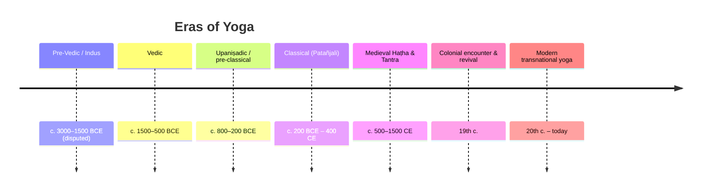

# 📜 History & Origins of Yoga

A long, contested history. Dates before the classical era are **approximate and
debated**; this note flags the contested points rather than smoothing them over.
The single most important corrective from recent scholarship (Mallinson & Singleton,
*Roots of Yoga*, 2017): "yoga" never named one continuous practice. It is an umbrella
over many lineages — Brahmanical, Buddhist, Jain, Śaiva, Tantric — that borrowed from
one another for over two millennia. Treat any "5,000-year-old unbroken tradition" claim
as marketing, not history.

## Timeline at a glance

## What the word *yoga* meant

The noun derives from the Sanskrit root **√yuj — "to yoke, to harness."** In the
**Ṛgveda** (the oldest layer, c. 1500 BCE) it overwhelmingly means literally *yoking
horses to a chariot*; of its handful of occurrences only a few (e.g. **RV 1.18.7,
1.30.7, 10.114.9**) carry any non-literal sense. The often-cited hymn **RV 5.81.1**,
to the rising Sun-god Savitṛ, is read as "harnessing" the mind — but this is a poetic
metaphor, **not** a description of yoga practice.

> ⚠️ **Myth vs. fact:** Popular books say "yoga begins in the Vedas." The Vedas supply
> the *vocabulary* (√yuj) and an ascetic-contemplative atmosphere (e.g. the cosmological
> *Nāsadīya Sūkta*, RV 10.129), **not** a yoga system. The Indologist Karel Werner is
> blunt: the Ṛgveda "does not describe yoga, and there is little evidence of practices."

## Pre-classical roots

### Indus Valley (disputed)

The so-called **Paśupati seal** (Mohenjo-daro, c. 2350–2000 BCE), excavated under
**John Marshall**, shows a horned figure sometimes read as a proto-Śiva seated in a
"yogic" posture. The chain of inference is fragile:

*Source: [Wikimedia Commons](https://commons.wikimedia.org/wiki/File:Shiva_Pashupati.jpg) — Public Domain (Public Domain Mark 1.0). Artefact in the National Museum, New Delhi.*

| Claim | Status |
|---|---|
| Figure is seated cross-legged in *mūlabandhāsana* | ⚠️ posture not securely identifiable (Flood) |
| Figure is "proto-Śiva / Paśupati" | ⚠️ challenged since **Doris Srinivasan (1976)** |
| Therefore yoga is ~5,000 years old | ✗ rejected by most specialists |

The historian of religion **Geoffrey Samuel** (2008) calls the proto-yogic reading
"so dependent on reading later practices into the material that it is of little or no
use" for actual history. **Treat the Indus–yoga link as speculation, not evidence.**

### Vedic & Upaniṣadic

- **Vedas (c. 1500–500 BCE).** Hymn, sacrifice, and the *seeds* of ascetic/meditative
  ideas — not yoga proper.
- **Upaniṣads (c. 800–200 BCE).** The first clear use of *yoga* in a recognisable,
  technical sense:
  - **Kaṭha Upaniṣad 2.3.10–11** gives an early *definition*: when the five senses,
    the mind (*manas*) and the intellect (*buddhi*) are stilled — "**That firm holding
    back of the senses is what is called yoga**" (*tāṃ yogam iti manyante sthirām
    indriya-dhāraṇām*). Yoga here is **inner restraint**, not posture. Read the passage
    in Max Müller's open translation:
    [Kaṭha Upaniṣad, Sixth Vallī (Wikisource)](https://en.wikisource.org/wiki/Sacred_Books_of_the_East/Volume_15/Katha-upanishad).
  - **Śvetāśvatara Upaniṣad 2.8–2.9** (c. 400–200 BCE) is the oldest text to give
    practical bodily instruction: hold "the three upper parts" — *chest, neck and head*
    — erect, draw the senses inward "like a tortoise," and regulate the breath. This is
    seated meditative posture, the ancestor of **dhyānāsana**, not a posture repertoire.
    The erect-posture passage is in Max Müller's open translation of the Śvetāśvatara
    (Sacred Books of the East, vol. 15, p. 231 ff.):
    [full PD scan on Internet Archive](https://archive.org/details/wg915).

*Source: [Wikimedia Commons](https://commons.wikimedia.org/wiki/File:Aitareya_Upanishad,_Sanskrit,_Rigveda,_Devanagari_script,_1865_CE_manuscript.jpg) — CC BY-SA 4.0 (photograph by Ms Sarah Welch; underlying text is public domain). Lalchand Research Library, DAV College, Chandigarh.*
  - The **Maitrāyaṇīya Upaniṣad** (later, but pre-Patañjali) already lists a **six-limbed
    yoga** (*ṣaḍ-aṅga*: breath control, sense-withdrawal, dhyāna, concentration, reasoning,
    union) — the scaffolding Patañjali later expands to eight.
- **Sāṃkhya** metaphysics and the **Bhagavad Gītā**'s three paths (karma, bhakti, jñāna)
  give yoga its classical philosophical frame — see [[Philosophy-and-Concepts]] and
  [[Foundational-Texts]].

### Buddhist & Jain parallels (the śramaṇa background)

Yoga did not grow only out of Brahmanism. The renunciant **śramaṇa** ("striver")
movements of c. 500 BCE — **Buddhists, Jains, and Ājīvikas** — developed mind-body
techniques (*dhyāna/jhāna*, *tapas*) aimed at liberation, often **independently of**
the Vedic mainstream. Mallinson & Singleton argue these traditions were *first* to
systematise such methods, and that **Yogācāra Buddhism** is "essential to understand
yoga's early history" — its meditative vocabulary feeds straight into the
*Pātañjalayogaśāstra*. Jain *dhyāna* and the four jhānas of early Buddhism are siblings
of classical yoga, not borrowings from it. See [[Paths-and-Lineages]].

> ⚠️ **Contested ownership:** "Yoga is Hindu" is a modern, partly nationalist framing.
> The earliest *physical* haṭha text is itself **Buddhist** (see below).

## Classical yoga — Patañjali

Around the **early centuries CE**, the sage **Patañjali** compiled the
[[Foundational-Texts|Yoga Sūtras]] (the *Pātañjalayogaśāstra*, sūtra + commentary),
organising material drawn from **Sāṃkhya, Buddhism and older yoga traditions** into the
eight-limbed (*aṣṭāṅga*) path. The date is unverifiable; estimates range from **2nd c.
BCE to 4th–5th c. CE**, with many scholars favouring **c. 350–450 CE**.

This is **"classical yoga" / Rāja yoga** — overwhelmingly meditative and soteriological.
Famously, **YS 1.2**: *yogaś citta-vṛtti-nirodhaḥ* — "yoga is the stilling of the
fluctuations of the mind." Here **āsana** (YS 2.46, *sthira-sukham āsanam*) means simply
a *steady, comfortable seat* for meditation — **not** a posture repertoire.

## Medieval Haṭha & Tantra (c. 500–1500 CE)

Tantric and **Nāth** traditions develop the **subtle-body** model — *nāḍīs*, *cakras*,
*kuṇḍalinī*, *prāṇa* — and the physical techniques of haṭha yoga. The legendary lineage
runs **Matsyendranāth** (early 10th c.?) → **Gorakṣanāth / Gorakhnāth** (c. 11th–12th
c.), founders of the *Nātha Sampradāya*; in popular tradition almost all early haṭha
texts are credited to these *siddhas*. Their early practice is sometimes called
**laya-yoga**, "the yoga of dissolution," raising *kuṇḍalinī* through the channels.

*Source: [Wikimedia Commons](https://commons.wikimedia.org/wiki/File:Illustrated_manuscript_depiction_of_Gorakhnath_under_a_tree_outside_his_hut,_ca.1715.jpg) — Public Domain (published before 1931). Wellcome Collection, Hindi MS 371.*

The genuinely datable foundation, however, is earlier and elsewhere:

| Text | Date | Notes |
|---|---|---|
| **Amṛtasiddhi** | colophon **2 March 1160 CE**; composed late 11th c. | ⚠️ the **earliest** systematic haṭha text — and a **Vajrayāna Buddhist** work (invokes the siddha Virūpa); teaches *mahābandha, mahāmudrā, mahāvedha* to retain *bindu* |
| **Gorakṣaśataka / early Nāth works** | 12th–13th c. | adds *bandhas* + *kuṇḍalinī* raising |
| **Śiva Saṃhitā** | c. 1300–1500 (Mallinson) | tantric/haṭha synthesis |
| **Haṭha Yoga Pradīpikā** (Svātmārāma) | 15th c. | the classic manual; ~15 āsanas |
| **Gheraṇḍa Saṃhitā** | c. 17th c. | 32 āsanas; "seven-limb" *ghaṭastha* yoga |

So the physical, posture-and-breath yoga most people imagine is **medieval, tantric,
and partly Buddhist in origin** — and still āsana-light by modern standards. See
[[Foundational-Texts]] and [[Asana-Catalogue]].

*Source: [Wikimedia Commons](https://commons.wikimedia.org/wiki/File:Jogapradipika_16_Mayurasana.jpg) — Public Domain (faithful reproduction of an 1830 two-dimensional work). One of 84 āsana paintings in the manuscript.*

## The colonial encounter & revival (19th c.)

Under British rule yoga was marginal, often associated with disreputable wandering
ascetics. The hinge event of *modern* yoga: **Swami Vivekānanda**'s address to the
**World's Parliament of Religions**, opening **11 September 1893** at Chicago's
Art Institute building, where he greeted "**Sisters and brothers of America!**" His
1896 book **_Rāja Yoga_** repackaged Patañjali for a Western audience — emphasising
meditation and the four paths while **dismissing haṭha's bodily practices** as lower.
Vivekānanda thus shaped the *idea* of yoga in the West **before** posture yoga existed
there. See [[Key-Figures]].

*Source: [Wikimedia Commons](https://commons.wikimedia.org/wiki/File:Swami_Vivekananda-1893-09-signed.jpg) — Public Domain (published before 1901, anonymous authorship).*

## Modern postural yoga (20th c.)

Two parallel developments produced today's posture-centred yoga:

**1. The "scientific yoga" laboratory.** In **1924**, **Swami Kuvalayānanda** founded
**Kaivalyadhama** at Lonavla and launched **_Yoga Mīmāṃsā_**, the world's first
scientific journal on yoga — Singleton calls its output "prodigious," at once research
review and illustrated manual. Kuvalayānanda and **Yogendra** reframed āsana and
*prāṇāyāma* as *health and hygiene*, measurable in physiological terms.

**2. The Mysore Palace synthesis.** The defining scholarly argument is **Mark
Singleton**, *Yoga Body* (2010): much of today's flowing, posture-heavy yoga is a
**20th-century reworking** of haṭha. At the **Mysore Palace** in the 1930s–40s, under
the Maharaja's patronage, **T. Krishnamacharya** built a method Singleton describes as
"a synthesis of several extant methods of physical training that... would have fallen
well outside any definition of yoga" — fusing haṭha with **British army calisthenics**
and the Danish **Niels Bukh**'s *Primitive Gymnastics* (English ed. 1925), amid Indian
nationalist physical-culture revival. From Krishnamacharya's Mysore *śālā* descend his
students **Pattabhi Jois** (Aṣṭāṅga Vinyāsa) and **B.K.S. Iyengar** — and thus most
transnational studio yoga, which then "returned" West as "pure" ancient Indian practice.
See [[Paths-and-Lineages]] and [[Key-Figures]].

> ⚠️ **Contested:** the *degree* of modern invention is debated. Singleton's own later
> work with Mallinson — *Roots of Yoga* (2017) — documents real pre-modern āsana lineages
> (e.g. the **122 postures of the 19th-c. _Śrītattvanidhi_** from the Mysore court itself),
> so "modern yoga invented postures from nothing" is **too strong**. The accurate claim is
> a **selective reworking and dramatic expansion** of a thin medieval āsana repertoire —
> not pure fabrication, and not unbroken inheritance. See [[Asana-Catalogue]].

## Related
- This very era-by-era story → [[History-and-Origins]]
- Philosophy this history produced → [[Philosophy-and-Concepts]]
- The lineages that carry it → [[Paths-and-Lineages]]
- The people who made it → [[Key-Figures]]
- Source texts → [[Foundational-Texts]]
- The postures themselves → [[Asana-Catalogue]]

## Sources

**Open primary sources (full text)**
- [Kaṭha Upaniṣad — Max Müller translation (Wikisource, public domain)](https://en.wikisource.org/wiki/Sacred_Books_of_the_East/Volume_15/Katha-upanishad) — contains the "firm holding back of the senses" definition (Sixth Vallī, 10–11).
- [Śvetāśvatara Upaniṣad — Max Müller, *Sacred Books of the East* vol. 15 (Internet Archive PD scan)](https://archive.org/details/wg915) — the erect-posture / breath-regulation passage is at p. 231 ff.
- [Muṇḍaka Upaniṣad — Max Müller translation (Wikisource, public domain)](https://en.wikisource.org/wiki/Sacred_Books_of_the_East/Volume_15/Mundaka-upanishad) — companion text in the same volume.

**Secondary**
- [Yoga — Wikipedia (etymology, śramaṇa origins, Werner)](https://en.wikipedia.org/wiki/Yoga)
- [Pashupati seal — Wikipedia (Marshall, Srinivasan, Samuel, Flood)](https://en.wikipedia.org/wiki/Pashupati_seal)
- [Katha Upanishad 2.3.11 — VivekaVani](https://vivekavani.com/kau2c3v11/)
- [Shvetashvatara Upanishad — Wikipedia (2.8–2.9 erect posture)](https://en.wikipedia.org/wiki/Shvetashvatara_Upanishad)
- [Amritasiddhi — Wikipedia (1160 CE Vajrayāna Buddhist haṭha text)](https://en.wikipedia.org/wiki/Amritasiddhi)
- [Hatha yoga — Wikipedia (Nāth siddhas, manuals, datings)](https://en.wikipedia.org/wiki/Hatha_yoga)
- [Swami Kuvalayananda — Wikipedia (Kaivalyadhama 1924, Yoga Mimamsa)](https://en.wikipedia.org/wiki/Swami_Kuvalayananda)
- [Kaivalyadhama — Wikipedia](https://en.wikipedia.org/wiki/Kaivalyadhama)
- [Yoga Sūtras of Patañjali — Wikipedia](https://en.wikipedia.org/wiki/Yoga_Sutras_of_Patanjali)
- [Mark Singleton — Wikipedia (Yoga Body, Krishnamacharya, Niels Bukh)](https://en.wikipedia.org/wiki/Mark_Singleton_(yoga_scholar))
- [Yoga Body — Wikipedia](https://en.wikipedia.org/wiki/Yoga_Body)
- [Swami Vivekananda at the Parliament of the World's Religions — Wikipedia](https://en.wikipedia.org/wiki/Swami_Vivekananda_at_the_Parliament_of_the_World%27s_Religions)
- [Raja Yoga (book, 1896) — Wikipedia](https://en.wikipedia.org/wiki/Raja_Yoga_(book))
- [Beyond Hinduism: Buddhist, Jain & Sufi roots of yoga — Quartz India](https://qz.com/india/897499/beyond-hinduism-yoga-also-has-roots-in-buddhist-jain-and-sufi-traditions)
