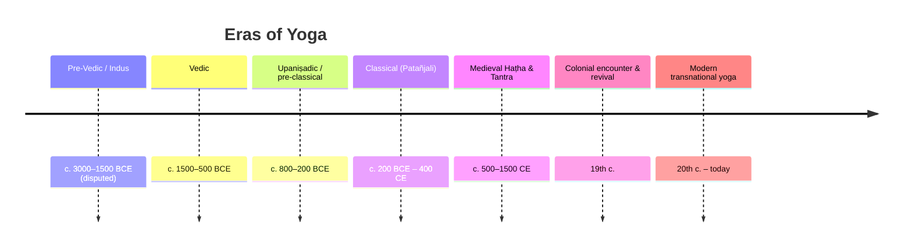

# 📜 History & Origins of Yoga

A long, contested history. Dates before the classical era are **approximate and
debated**; this note flags the contested points rather than smoothing them over.

## Timeline at a glance

## Pre-classical roots

- **Indus Valley (disputed).** Seals such as the so-called *Paśupati* seal are sometimes
  cited as proto-yogic, but the link is **speculative** and rejected by many scholars.
- **Vedas (c. 1500–500 BCE).** Hymns and ritual; the *seeds* of ascetic and meditative
  ideas rather than yoga proper.
- **Upaniṣads (c. 800–200 BCE).** The first clear philosophical statements of meditation,
  breath and the inner self; the *Kaṭha* and *Śvetāśvatara* Upaniṣads use the word *yoga*
  in a recognizable sense. ([Yoga Basics](https://www.yogabasics.com/learn/history-of-yoga/))
- **Sāṃkhya** metaphysics and the **Bhagavad Gītā**'s three paths (karma, bhakti, jñāna)
  give yoga its classical philosophical frame — see [[Philosophy-and-Concepts]].

## Classical yoga — Patañjali

Around the **early centuries CE**, the sage **Patañjali** compiled the [[Foundational-Texts|Yoga Sūtras]],
organising knowledge drawn from **Sāṃkhya, Buddhism and older yoga traditions** into the
eight-limbed (*aṣṭāṅga*) path. The exact date is unverifiable; estimates range widely
(commonly 2nd c. BCE – 4th c. CE). ([Yoga Sūtras — Wikipedia](https://en.wikipedia.org/wiki/Yoga_Sutras_of_Patanjali))

This is **"classical yoga" / Rāja yoga** — overwhelmingly meditative and soteriological.
Āsana here means simply a *steady, comfortable seat* for meditation, **not** a posture
repertoire.

## Medieval Haṭha & Tantra (c. 500–1500 CE)

Tantric and **Nāth** traditions (Matsyendranāth, Gorakṣanāth) develop the **subtle-body**
model — *nāḍīs*, *cakras*, *kuṇḍalinī*, *prāṇa* — and the physical techniques of
[[Practices|haṭha yoga]]. The classic manuals are compiled in this window:
the **Haṭha Yoga Pradīpikā** (Svātmārāma, 15th c.), **Gheraṇḍa Saṃhitā** (c. 17th c.),
and **Śiva Saṃhitā** (dated 1300–1500 by Mallinson). See [[Foundational-Texts]].

## The colonial encounter & revival (19th c.)

Under British rule yoga was marginal, practiced by relatively few. **Swami Vivekānanda**'s
address to the **1893 World's Parliament of Religions** in Chicago re-presented yoga
(emphasising Rāja and the four paths) to a Western audience and is widely treated as the
hinge of *modern* yoga. ([Facts and Details](https://factsanddetails.com/india/Religion_Caste_Folk_Beliefs_Death/sub7_2d/entry-5642.html))

## Modern postural yoga (20th c.)

The defining scholarly argument (**Mark Singleton**, *Yoga Body*, 2010): much of today's
**posture-centred** yoga is a **20th-century reworking** of haṭha — dropping most haṭha
practices except *āsana*, shifting the goal from *mokṣa* to **exercise/health**, and
absorbing many standing postures from **European/Indian physical culture** (e.g. Niels
Bukh's *Primitive Gymnastics*) amid Indian nationalism. Figures like **Yogendra**,
**Kuvalayānanda** and especially **T. Krishnamacharya** systematised this; it then
"returned" West as "pure" Indian practice. ([Singleton — Wikipedia](https://en.wikipedia.org/wiki/Mark_Singleton_(yoga_scholar)) · [Yoga Journal: Krishnamacharya's Legacy](https://www.yogajournal.com/yoga-101/history-of-yoga/krishnamacharya-s-legacy/))

> ⚠️ **Contested:** the *degree* of modern invention is debated. Mallinson & Singleton's
> *Roots of Yoga* (2017) shows real pre-modern āsana lineages (e.g. the 122 postures of the
> 19th-c. *Sritattvanidhi*), so "modern yoga invented postures from nothing" is too strong —
> the truth is a **selective reworking**, not pure fabrication. See [[Asana-Catalogue]].

## Related
- Philosophy this history produced → [[Philosophy-and-Concepts]]
- The lineages that carry it → [[Paths-and-Lineages]]
- Source texts → [[Foundational-Texts]]

## Sources
- [Yoga Sūtras of Patañjali — Wikipedia](https://en.wikipedia.org/wiki/Yoga_Sutras_of_Patanjali)
- [Mark Singleton — Wikipedia](https://en.wikipedia.org/wiki/Mark_Singleton_(yoga_scholar))
- [History of Yoga — Yoga Basics](https://www.yogabasics.com/learn/history-of-yoga/)
- [Krishnamacharya's Legacy — Yoga Journal](https://www.yogajournal.com/yoga-101/history-of-yoga/krishnamacharya-s-legacy/)
- [Major Figures in Modern Yoga — Facts and Details](https://factsanddetails.com/india/Religion_Caste_Folk_Beliefs_Death/sub7_2d/entry-5642.html)
