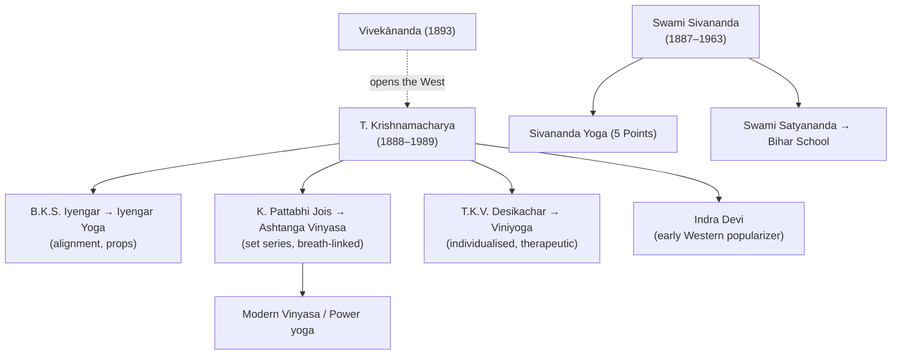

# 🌿 Paths & Lineages

Ask a yogi how to reach liberation and you will not get one answer — you will get
several, because the tradition long ago noticed that people are not the same. The
scholar and the lover, the doer and the contemplative each arrive at the same summit
by a different face of the mountain. This page holds two stories of that branching.
The first is ancient: the **classical paths**, a map of liberation drawn to fit the
shape of a human temperament. The second is startlingly recent: the **modern schools**
of posture, nearly all of which can be traced — like rivers to a single spring — back
to one twentieth-century teacher in Mysore, [[Key-Figures|T. Krishnamacharya]].

## The classical paths

The idea that there are "four paths" of yoga is, in its tidy modern form, largely the
work of **Vivekānanda**, who carried it West in the 1890s and read it out of the
*Bhagavad Gītā*. His insight was generous rather than divisive: the paths are not
rival sects competing for the one true method, but four answers to a single question —
*given who you actually are, how do you get free?* A mind that lives in ideas will
not be moved by ritual; a heart that overflows with love will not be satisfied by
cold analysis. So the tradition offers each its own door.

For the **intellectual**, there is **jñāna**, the yoga of knowledge: liberation through
relentless discernment (*viveka*), the patient work of study, reflection, and
contemplation (*śravaṇa*, *manana*, *nididhyāsana*) until the false self is seen through.
For the **devotional**, there is **bhakti**, the yoga of the open heart — love poured
out and surrendered to the divine or to a chosen deity (*iṣṭa-devatā*), until the
boundary between worshipper and worshipped dissolves. For the **active** person who
cannot sit still, there is **karma**, the yoga of action performed selflessly, with the
hands fully in the work but the grip on its results let go. And for the **meditative**,
there is **rāja**, the "royal" path of mental mastery — Patañjali's eight limbs, the
classical yoga of the [[Foundational-Texts|Yoga Sūtras]] itself.

| Path | "Yoga of…" | Method | For the temperament that is… |
|---|---|---|---|
| **Jñāna** | knowledge | discernment (*viveka*); study (*śravaṇa*), reflection (*manana*), contemplation (*nididhyāsana*) | intellectual |
| **Bhakti** | devotion | love and surrender to the divine / a chosen deity (*iṣṭa-devatā*) | devotional |
| **Karma** | action | selfless action without attachment to results | active |
| **Rāja** | meditation | Patañjali's eight limbs; "royal" path of mental control | meditative |

To these four the tradition often adds others that work on the body and its subtle
energies before the mind can be stilled: **haṭha**, the "forceful" yoga that prepares
the body as an instrument; **mantra**, working through sacred sound; and
**laya / kuṇḍalinī**, the yoga of dissolution that raises the coiled energy at the base
of the spine. These are less alternatives than preparations — and it is haṭha, the
discipline of the body, that the modern world would seize on and turn into everything
we now call "yoga." ([swamij.com](https://swamij.com/four-paths-of-yoga.htm) · [One Yoga](https://oneyogathailand.com/types-of-yoga-explained-a-guide-to-the-four-yogic-paths-karma-bhakti-jnana-and-raja/) · [Three Yogas — Wikipedia](https://en.wikipedia.org/wiki/Three_Yogas))

## The modern lineages

Here the story narrows to a single human life. Almost every posture style practised in
studios today — the alignment-obsessed and the sweat-soaked, the therapeutic and the
athletic — descends from **T. Krishnamacharya** (1888–1989), who taught in the palace of
the Maharaja of Mysore in the 1930s. He was not a populariser himself; he was a teacher
of teachers, and what makes his legacy so strange and rich is that his most famous
students each took away something completely different. Watching them fan out across the
world is like watching the same seed produce an orchard of unlike fruit.

### Krishnamacharya's tree

Consider his brother-in-law, **B.K.S. Iyengar** (1918–2014). A sickly boy whom
Krishnamacharya drilled hard, he grew into the great anatomist of the practice, building
**Iyengar Yoga** around precise **alignment**, long held postures, and an ingenious
arsenal of **props** — belts, blocks, ropes — that let any body, however stiff or injured,
find the shape correctly. His *Light on Yoga* became the field's standard text.

His fellow student **K. Pattabhi Jois** drew the opposite lesson. Where Iyengar slowed
everything down, Jois sped it up, transmitting Krishnamacharya's vigorous teaching as
**Ashtanga Vinyasa** — fixed **series** of postures stitched to the breath (*vinyāsa*) and
to a steady gaze (*dṛṣṭi*), a moving meditation done as relentless flow. From this single
demanding system would later branch nearly all the **vinyasa** and **power** styles that
fill modern gyms.

A third heir, Krishnamacharya's own son **T.K.V. Desikachar** (1938–2016), inherited the
teacher's late-life conviction that there is no one correct sequence at all. His
**Viniyoga** turns the practice inward and outward at once: yoga **adapted to the
individual**, shaped to a particular body, age, and ailment, with a frankly therapeutic
aim, carried on at the Krishnamacharya Yoga Mandiram in Chennai.

And it was **Indra Devi**, one of the first Western women Krishnamacharya ever agreed to
teach, who became the great ambassador — carrying the practice to Hollywood, Moscow, and
beyond, and helping make "yoga" a word the whole world would come to know.

### The Sivananda / Rishikesh stream

Not every modern current runs through Mysore. Up in Rishikesh, **Swami Sivananda**
(1887–1963) — a physician turned monk — founded the Divine Life Society in 1936 and took
a more synthesising path, blending haṭha and rāja into a simple householder's program he
called the **"Five Points"**: proper exercise (*āsana*), breathing, relaxation, diet, and
positive thinking with meditation. His own students extended the line: **Swami Satyananda**
founded the **Bihar School of Yoga**, where the deep guided relaxation of *Yoga Nidrā* was
codified and a whole systematic curriculum laid down. ([Sivananda / lineages](https://grokipedia.com/page/List_of_yoga_schools))

### Other major modern lineages

Around these two great trunks grow the styles most people meet by name. **Kuṇḍalinī Yoga**,
brought West by Yogi Bhajan in 1969, works through kriyās, mantra, and breath to raise the
serpent energy. **Vinyasa** and **power yoga** are the athletic flow children of Ashtanga.
**Bikram** and the hot-yoga family run a fixed 26-posture sequence in a deliberately heated
room. **Yin Yoga** does the opposite — long, passive, floor-bound holds that work the
connective tissue, with a Taoist accent — while **Restorative Yoga**, descended from
Iyengar's prop-craft, supports the body completely and asks only that you rest.

→ Each branded modern style is detailed in [[Modern-Styles]].

## Related
- The teacher behind most of this → [[Key-Figures]]
- Where the four paths come from → [[Foundational-Texts]] (Bhagavad Gītā)
- What "Haṭha" actually involves → [[Practices]]

## Sources
- [Four Paths of Yoga — swamij.com](https://swamij.com/four-paths-of-yoga.htm)
- [Types of Yoga: the Four Paths — One Yoga](https://oneyogathailand.com/types-of-yoga-explained-a-guide-to-the-four-yogic-paths-karma-bhakti-jnana-and-raja/)
- [Three Yogas — Wikipedia](https://en.wikipedia.org/wiki/Three_Yogas)
- [List of yoga schools — Grokipedia](https://grokipedia.com/page/List_of_yoga_schools)
- [Krishnamacharya's Legacy — Yoga Journal](https://www.yogajournal.com/yoga-101/history-of-yoga/krishnamacharya-s-legacy/)
