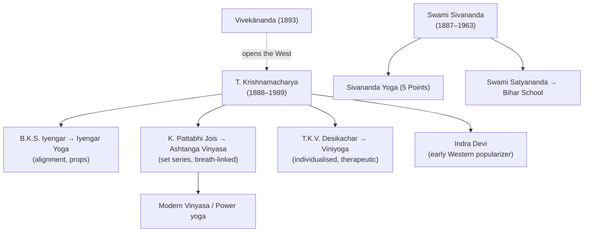

# 🌿 Paths & Lineages

Two layers: the **classical paths** (temperament-based routes to liberation) and the
**modern schools** (mostly posture lineages descending from one teacher,
[[Key-Figures|T. Krishnamacharya]]).

## The classical paths

Popularised in the West as "four paths" by **Vivekānanda**, drawing on the *Bhagavad Gītā*.
They are complementary, not exclusive — suited to different temperaments. ([swamij.com](https://swamij.com/four-paths-of-yoga.htm))

| Path | "Yoga of…" | Method | For the temperament that is… |
|---|---|---|---|
| **Jñāna** | knowledge | discernment (*viveka*); study (*śravaṇa*), reflection (*manana*), contemplation (*nididhyāsana*) | intellectual |
| **Bhakti** | devotion | love and surrender to the divine / a chosen deity (*iṣṭa-devatā*) | devotional |
| **Karma** | action | selfless action without attachment to results | active |
| **Rāja** | meditation | Patañjali's eight limbs; "royal" path of mental control | meditative |

*Often added:* **Haṭha** (forceful/physical, preparing the body), **Mantra**, and
**Laya/Kuṇḍalinī** (dissolution, raising kuṇḍalinī). Rāja yoga = the classical yoga of the
[[Foundational-Texts|Yoga Sūtras]]. ([One Yoga](https://oneyogathailand.com/types-of-yoga-explained-a-guide-to-the-four-yogic-paths-karma-bhakti-jnana-and-raja/) · [Three Yogas — Wikipedia](https://en.wikipedia.org/wiki/Three_Yogas))

## The modern lineages

### Krishnamacharya's tree (the dominant modern source)
- **Iyengar Yoga** — B.K.S. Iyengar (1918–2014): precise **alignment**, long holds, heavy
  use of **props** (belts, blocks, ropes); text *Light on Yoga*.
- **Ashtanga Vinyasa** — K. Pattabhi Jois: fixed **series** of postures linked to breath
  (*vinyāsa*) and *dṛṣṭi*; the seed of most modern flow styles.
- **Viniyoga** — T.K.V. Desikachar (1938–2016): yoga **adapted to the individual**,
  therapeutic emphasis (Krishnamacharya Yoga Mandiram, Chennai).
- **Indra Devi** — among the first Western women taught by Krishnamacharya; major
  popularizer.

### The Sivananda / Rishikesh stream
- **Sivananda Yoga** — from Swami **Sivananda**'s Divine Life Society (Rishikesh, 1936);
  synthesises Haṭha + Rāja into the **"Five Points"**: proper exercise (*āsana*), breathing,
  relaxation, diet, and positive thinking/meditation. ([Sivananda / lineages](https://grokipedia.com/page/List_of_yoga_schools))
- **Bihar School of Yoga** — Swami **Satyananda**; codified *Yoga Nidrā* and a systematic
  curriculum.

### Other major modern lineages
- **Kuṇḍalinī Yoga** (Yogi Bhajan, 1969 West) — kriyās, mantra, breath to raise kuṇḍalinī.
- **Vinyasa / Power Yoga** — athletic flow descended from Ashtanga.
- **Bikram / Hot Yoga** — fixed 26-posture sequence in a heated room.
- **Yin Yoga** — long-held passive floor postures (connective tissue, Taoist influence).
- **Restorative Yoga** — fully supported, therapeutic rest (Iyengar-derived).

→ Each branded modern style is detailed in [[Modern-Styles]].

## Related
- The teacher behind most of this → [[Key-Figures]]
- Where the four paths come from → [[Foundational-Texts]] (Bhagavad Gītā)
- What "Haṭha" actually involves → [[Practices]]

## Sources
- [Four Paths of Yoga — swamij.com](https://swamij.com/four-paths-of-yoga.htm)
- [Types of Yoga: the Four Paths — One Yoga](https://oneyogathailand.com/types-of-yoga-explained-a-guide-to-the-four-yogic-paths-karma-bhakti-jnana-and-raja/)
- [Three Yogas — Wikipedia](https://en.wikipedia.org/wiki/Three_Yogas)
- [List of yoga schools — Grokipedia](https://grokipedia.com/page/List_of_yoga_schools)
- [Krishnamacharya's Legacy — Yoga Journal](https://www.yogajournal.com/yoga-101/history-of-yoga/krishnamacharya-s-legacy/)
