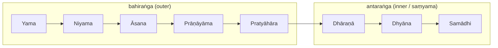

# 🪷 Philosophy & Core Concepts

Classical yoga is built on **Sāṃkhya** metaphysics and organised by Patañjali's
**eight limbs**. Later **Tantra/Vedānta** add the subtle-body map (koshas, chakras).

## The eight limbs (aṣṭāṅga)

Patañjali's ladder from outer conduct to inner absorption ([Ashtanga — Wikipedia](https://en.wikipedia.org/wiki/Ashtanga_(eight_limbs_of_yoga))):

1. **Yama** — ethical restraints
2. **Niyama** — observances
3. **Āsana** — posture (a steady, comfortable seat)
4. **Prāṇāyāma** — breath regulation
5. **Pratyāhāra** — withdrawal of the senses
6. **Dhāraṇā** — concentration
7. **Dhyāna** — meditation
8. **Samādhi** — absorption / union

### The yamas & niyamas

| Yamas (restraints) | Niyamas (observances) |
|---|---|
| **Ahiṃsā** — non-violence | **Śauca** — cleanliness/purity |
| **Satya** — truthfulness | **Santoṣa** — contentment |
| **Asteya** — non-stealing | **Tapas** — discipline/austerity |
| **Brahmacarya** — moderation/continence | **Svādhyāya** — self-study & scripture |
| **Aparigraha** — non-grasping | **Īśvara-praṇidhāna** — surrender to the divine |

## Sāṃkhya metaphysics — the frame

Yoga inherits Sāṃkhya's **dualism** ([Samkhya — Wikipedia](https://en.wikipedia.org/wiki/Samkhya)):

- **Puruṣa** — pure, attribute-less **consciousness** (the witness).
- **Prakṛti** — unconscious **matter/nature**, out of which mind and world unfold.
- **The three guṇas** — strands of prakṛti whose balance shapes everything:
  **sattva** (clarity/harmony), **rajas** (activity/passion), **tamas** (inertia/dullness).
  ([Yoga International: the gunas](https://yogainternational.com/article/view/the-gunas-natures-three-fundamental-forces/))

**The goal — *kaivalya*:** discerning Puruṣa as *separate* from Prakṛti, disentangling pure
consciousness from the mind's defilements (the **kleśas**: ignorance, ego, attachment,
aversion, fear of death). **Samādhi** is the absorptive state in which this is realised.

## The subtle body — koshas & chakras

A Tantric/Vedāntic overlay (see [[Practices]] for the energetic mechanics):

- **Pañca-koshas** — five "sheaths" wrapping the Self, gross → subtle
  ([Healthline: koshas](https://www.healthline.com/health/mental-health/koshas)):

  | Kosha | "Sheath of…" |
  |---|---|
  | **Annamaya** | food / the physical body |
  | **Prāṇamaya** | vital energy (breath, nāḍīs) |
  | **Manomaya** | mind (thought, emotion) |
  | **Vijñānamaya** | wisdom / discernment |
  | **Ānandamaya** | bliss (closest to the Self) |

- **Chakras** — energy centres along the spine in the *astral* body, threaded by the
  **nāḍīs** and roused by **kuṇḍalinī**. (Koshas = *layers* over the Self; chakras =
  *centres* within the subtle body.)

## Related
- The text this comes from → [[Foundational-Texts]] (Yoga Sūtras)
- How the subtle body is *worked* → [[Practices]]
- The historical arc → [[History-and-Origins]]

## Sources
- [Ashtanga (eight limbs) — Wikipedia](https://en.wikipedia.org/wiki/Ashtanga_(eight_limbs_of_yoga))
- [8 Limbs of Yoga — Yoga Journal](https://www.yogajournal.com/yoga-101/philosophy/8-limbs-of-yoga/eight-limbs-of-yoga/)
- [Samkhya — Wikipedia](https://en.wikipedia.org/wiki/Samkhya)
- [The Gunas — Yoga International](https://yogainternational.com/article/view/the-gunas-natures-three-fundamental-forces/)
- [Koshas — Healthline](https://www.healthline.com/health/mental-health/koshas)
