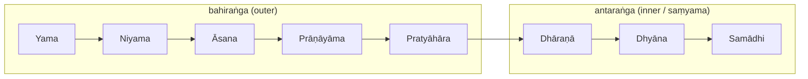

# 🪷 Philosophy & Core Concepts

Classical yoga is built on **Sāṃkhya** metaphysics and organised by Patañjali's
**eight limbs** (*Yoga Sūtras*, c. 2nd–4th c. CE). Later **Tantra** and **Vedānta**
reframe the goal and add the subtle-body map (koshas, chakras, nāḍīs). This note
runs from ethics outward to absorption, then from gross body inward to the witness.

> [!note] How the pieces fit
> Sāṃkhya supplies the **map of reality** (puruṣa vs. prakṛti). Patañjali supplies
> the **method** (the eight limbs, ending in samādhi). Tantra/Vedānta supply
> alternative **goals** (union / non-duality rather than isolation).

## The eight limbs (aṣṭāṅga)

Patañjali's ladder from outer conduct to inner absorption ([Ashtanga — Wikipedia](https://en.wikipedia.org/wiki/Ashtanga_(eight_limbs_of_yoga))). The first five are **bahiraṅga** ("outer" limbs, preparing body and senses); the last three are **antaraṅga** ("inner" limbs) and together form **saṃyama** — the combined instrument of insight:

1. **Yama** — ethical restraints (how we relate to the world)
2. **Niyama** — observances (how we relate to ourselves)
3. **Āsana** — posture; for Patañjali, *sthira-sukham* — "steady and comfortable" — a seat held effortlessly, not a gymnastic shape
4. **Prāṇāyāma** — regulation of breath / vital energy
5. **Pratyāhāra** — withdrawal of the senses from their objects
6. **Dhāraṇā** — concentration: "binding consciousness to a single place," one-pointed effort
7. **Dhyāna** — meditation: an *uninterrupted flow* toward that one point; awareness without strain
8. **Samādhi** — absorption, in which the meditator, the act of meditating, and the object collapse into one

> [!tip] Saṃyama
> When dhāraṇā, dhyāna and samādhi are applied **to the same object**, Patañjali
> calls the combination *saṃyama*. It is the engine of yogic insight (*prajñā*) —
> and, in the *Vibhūti Pāda*, the source of the famous yogic powers (*siddhis*),
> which Patañjali then warns are obstacles to the final goal.

### The yamas & niyamas

The ethical floor of the whole edifice. Patañjali calls the yamas the "great vow" (*mahāvrata*), binding regardless of birth, place, time or circumstance ([Yoga Sutras — Wikipedia](https://en.wikipedia.org/wiki/Yoga_Sutras_of_Patanjali)):

| Yamas (restraints — outward) | Niyamas (observances — inward) |
|---|---|
| **Ahiṃsā** — non-violence; the root from which the others follow | **Śauca** — cleanliness/purity, of body and mind |
| **Satya** — truthfulness in word and thought | **Santoṣa** — contentment, non-craving for what is absent |
| **Asteya** — non-stealing, including of credit, time, attention | **Tapas** — disciplined heat/austerity that "burns" impurity |
| **Brahmacarya** — moderation; right use of vital (esp. sexual) energy | **Svādhyāya** — self-study & recitation of scripture |
| **Aparigraha** — non-grasping, non-hoarding, non-possessiveness | **Īśvara-praṇidhāna** — surrender/devotion to the divine (*Īśvara*) |

> [!note] Why *Īśvara* in a "godless" system?
> Sāṃkhya is famously non-theistic, yet Patañjali installs **Īśvara** — a special,
> never-bound puruṣa — as an optional focus of devotion and a shortcut to samādhi.
> This is one of yoga's signature departures from strict Sāṃkhya.

## The five kleśas — what binds us

Before liberation can be discussed, Patañjali names the **afflictions** that drive
suffering and keep consciousness entangled (*Yoga Sūtra* 2.3 — [The Yoga Institute](https://theyogainstitute.org/5-kleshas-root-causes-of-suffering-in-life)). *Avidyā* is the field in which the other four grow:

1. **Avidyā** — fundamental *ignorance*; mistaking the impermanent for the permanent, the not-self for the Self. The root of the rest.
2. **Asmitā** — *egoism*; identifying pure awareness with the instrument that perceives (the mind/intellect).
3. **Rāga** — *attachment*; clinging to pleasure and its sources.
4. **Dveṣa** — *aversion*; recoil from pain, manifesting as anger, anxiety, hatred.
5. **Abhiniveśa** — *clinging to life / fear of death*; said to grip even the wise.

Yoga's practices (especially *kriyā-yoga*: tapas, svādhyāya, īśvara-praṇidhāna) progressively thin the kleśas until discriminative knowledge can dissolve them.

## Sāṃkhya metaphysics — the frame

Yoga inherits Sāṃkhya's **dualism**: two irreducible realities ([Samkhya — Wikipedia](https://en.wikipedia.org/wiki/Samkhya)).

- **Puruṣa** — pure, attribute-less **consciousness**; the witness. Uncaused, unchanging, plural, never an effect of anything.
- **Prakṛti** — unconscious **primordial nature/matter**, uncaused but the cause of everything else. Mind and world unfold *from* prakṛti — including the intellect itself.
- **The three guṇas** — the strands of prakṛti whose shifting balance shapes all phenomena:
  **sattva** (clarity/harmony/light), **rajas** (activity/passion/motion), **tamas** (inertia/dullness/mass).
  ([Yoga International: the gunas](https://yogainternational.com/article/view/the-gunas-natures-three-fundamental-forces/))

### The 25 tattvas (puruṣa + 24 evolutes of prakṛti)

Sāṃkhya counts reality in **25 tattvas** ("principles"): puruṣa, unmanifest prakṛti, and the **23 evolutes** that unfold when the guṇas lose equilibrium ([24 Tattvas — Hindu Website](https://www.hinduwebsite.com/24principles.asp); [25 Tattvas — Poojn](https://www.poojn.in/post/31559/understanding-the-25-tattvas-in-samkhya-a-clear-explanation)). The cascade is *inner → outer*:

| # | Tattva(s) | What it is |
|---|---|---|
| 1 | **Puruṣa** | pure consciousness (the witness) — *not* an evolute |
| 2 | **Prakṛti** | unmanifest root-nature (guṇas in equilibrium) |
| 3 | **Mahat / Buddhi** | the "great one" — intellect, discrimination, will |
| 4 | **Ahaṃkāra** | ego-sense; the "I-maker" that branches into the rest |
| 5 | **Manas** | mind; coordinator of sensation and action |
| 6–10 | **Jñānendriyas** | five sense-organs (ear, skin, eye, tongue, nose) |
| 11–15 | **Karmendriyas** | five action-organs (speech, hands, feet, excretion, generation) |
| 16–20 | **Tanmātras** | five subtle elements (sound, touch, form, taste, smell) |
| 21–25 | **Mahābhūtas** | five gross elements (ether, air, fire, water, earth) |

Mahat, ahaṃkāra and the tanmātras are *both* causes and effects; the gross elements are effects only; puruṣa and prakṛti are neither caused. Liberation is **not** destroying this machinery but *seeing through* it.

### The goal — *kaivalya*

In classical Yoga/Sāṃkhya the aim is **kaivalya** — "aloneness, isolation": the decisive **discernment** (*viveka*) that puruṣa is utterly *separate* from prakṛti, so that pure consciousness no longer mistakes the mind's movements for itself ([Samkhya — Wikipedia](https://en.wikipedia.org/wiki/Samkhya)). The witness simply *stops identifying* with what it watches. Note the polarity to come: here liberation is **separation**; in Tantra/Vedānta it becomes **union**.

### The stages of samādhi

Samādhi is not one state but a graded ascent ([Stages of Samadhi — VedicFeed](https://vedicfeed.com/stages-of-samadhi/); [Raja Yoga Samadhi — Divine Life Society](https://www.dlshq.org/discourse/raja-yoga-samadhi/)):

- **Samprajñāta** ("with cognition") — absorption that still has an **object/seed** (*sabīja*). The mind rests on something, refining through grosser-to-subtler supports (*vitarka → vicāra → ānanda → asmitā*). Often equated with **savikalpa** ("with distinction"): a trace of knower/known remains — "Thou and I are One."
- **Asamprajñāta** ("without cognition") — **seedless** (*nirbīja*) absorption; even the subtle object dissolves and all mental modifications (*vṛttis*) cease. Equated with **nirvikalpa** ("without distinction"): no remaining split between knower, knowing and known. From here ripens **kaivalya**.

| | Samprajñāta / Savikalpa | Asamprajñāta / Nirvikalpa |
|---|---|---|
| Object present? | yes (*sabīja*, seeded) | no (*nirbīja*, seedless) |
| Knower/known split? | a trace remains | fully dissolved |
| Mental modifications | refined, not stopped | wholly stilled |
| Leads to | deepening insight | kaivalya / liberation |

## The subtle body — koshas, bodies & chakras

> [!warning] ⚠️ Read this map as symbolic / experiential
> The chakras, nāḍīs and koshas are a **contemplative and energetic cartography**,
> not anatomy. They do not correspond to nerves, glands or organs, and modern
> attempts to pin chakras onto the endocrine system are interpretive overlays,
> not findings. Treat the whole subtle-body model as a *phenomenology of inner
> experience* — a language for what practitioners report — rather than biomedical fact.

This layer comes mainly from **Tantra** and **Vedānta** (see [[Practices]] for the energetic mechanics).

### Three bodies (śarīra-traya) & five koshas

Vedānta nests the human being in **three bodies**, which map onto the **five sheaths** (*pañca-kosha*) — gross → subtle → causal ([Three Bodies — Prana Sutra](https://www.prana-sutra.com/post/sthula-sukshma-karana-sharira); [Sharira Traya — Dharmawiki](https://dharmawiki.org/index.php/Sharira_Traya_(%E0%A4%B6%E0%A4%B0%E0%A5%80%E0%A4%B0%E0%A4%A4%E0%A5%8D%E0%A4%B0%E0%A4%AF%E0%A4%AE%E0%A5%8D))):

| Body (śarīra) | Contains kosha(s) | "Sheath of…" |
|---|---|---|
| **Sthūla** (gross) | Annamaya | food / the physical body |
| **Sūkṣma** (subtle) ⚠️ | Prāṇamaya | vital energy (breath, nāḍīs) |
| | Manomaya | mind (thought, emotion) |
| | Vijñānamaya | wisdom / discernment |
| **Kāraṇa** (causal) ⚠️ | Ānandamaya | bliss; nearest the Self |

The koshas are *layers wrapped over* the Self; in Vedānta the practitioner peels inward (*neti, neti* — "not this, not this") until only the witness remains. The causal body is the seed of the other two and the last to fall away.

### The chakras

Seven principal energy-centres (*cakra*, "wheel") strung along the **suṣumnā** within the subtle body — said to be *roused* by **kuṇḍalinī** rising from the base toward the crown ([Chakra names — Kathleen Karlsen](https://kathleenkarlsen.com/chakra-names/); [7 Chakras Chart — Arogya](https://www.arogyayogaschool.com/blog/7-chakras-chart/)). ⚠️ The "locations" below are **felt/symbolic** loci along the spinal axis, not organs:

| Chakra | Meaning | Location (symbolic) | Element | Bīja |
|---|---|---|---|---|
| **Mūlādhāra** (root) | "root support" | base of spine / perineum | earth | LAṂ |
| **Svādhiṣṭhāna** (sacral) | "one's own abode" | lower abdomen / sacrum | water | VAṂ |
| **Maṇipūra** (solar plexus) | "city of jewels" | navel / upper abdomen | fire | RAṂ |
| **Anāhata** (heart) | "unstruck" (sound) | centre of the chest | air | YAṂ |
| **Viśuddha** (throat) | "especially pure" | throat | ether/space | HAṂ |
| **Ājñā** (third eye) | "command / perceive" | between the eyebrows | mind/light | OṂ |
| **Sahasrāra** (crown) | "thousand-petalled" | crown of the head | beyond elements | (silent / AḤ) |

### The three principal nāḍīs

Of the thousands of *nāḍīs* ("channels") that carry **prāṇa** through the subtle body, three are central ([The Three Nadis — Fitsri](https://www.fitsri.com/yoga/nadis); [Subtle channels — Ekhart Yoga](https://www.ekhartyoga.com/articles/practice/subtle-energy-channels-kundalini-sushumna-ida-pingala)). ⚠️ These are experiential currents, not the physical spinal cord or autonomic nerves they are sometimes likened to:

- **Iḍā** — the left, "lunar," cooling/receptive current; associated with the parasympathetic, mind-quieting quality.
- **Piṅgalā** — the right, "solar," warming/active current; associated with energising, outward drive.
- **Suṣumnā** — the **central** channel along the spinal axis. Only when iḍā and piṅgalā are **balanced** does suṣumnā open, letting kuṇḍalinī ascend through the chakras toward sahasrāra.

> [!note] Koshas vs. chakras vs. nāḍīs
> Easy to conflate, but: **koshas** = nested *layers* over the Self; **chakras** =
> *centres* within the subtle body; **nāḍīs** = *channels* connecting them. Different
> geometries of the same inner cartography.

## Three goals, three reframings

The same practice points at different destinations depending on the school ([Reconciling Samkhya, Vedanta & Tantra — Auromere](https://auromere.wordpress.com/2012/09/28/reconciling-samkhya-vedanta-and-tantra/); [Nondualism — Wikipedia](https://en.wikipedia.org/wiki/Nondualism)):

- **Classical Yoga / Sāṃkhya** — **kaivalya**: *isolation*. Spirit and matter are ultimately two; liberation is disentangling puruṣa from prakṛti and abiding alone.
- **Vedānta (esp. Advaita)** — **mokṣa as non-duality**: *Ātman = Brahman*. There is no real second thing to be isolated from; "union" is the *recognition* that the individual self was never separate from the absolute.
- **Tantra** — **embodied union**: spirit (Śiva) and energy (Śakti) are two faces of one reality. Rather than escaping the body and world, the practitioner *transforms* them — kuṇḍalinī uniting Śakti with Śiva at the crown. Liberation **in** the body, not from it.

> [!tip] One word, two directions
> "Yoga" can mean **separation** (Sāṃkhya: severing puruṣa from prakṛti) *or*
> **union** (Tantra/Vedānta: yoking self to absolute). The history of the tradition
> is largely the swing between these poles — see [[History-and-Origins]].

## Related
- The texts this comes from → [[Foundational-Texts]] (the *Yoga Sūtras*, Upaniṣads, tantric corpus)
- How the subtle body is *worked* → [[Practices]]
- The historical arc, Sāṃkhya → Tantra → modern → [[History-and-Origins]]

## Sources
- [Ashtanga (eight limbs) — Wikipedia](https://en.wikipedia.org/wiki/Ashtanga_(eight_limbs_of_yoga))
- [Yoga Sutras of Patanjali — Wikipedia](https://en.wikipedia.org/wiki/Yoga_Sutras_of_Patanjali)
- [8 Limbs of Yoga — Yoga Journal](https://www.yogajournal.com/yoga-101/philosophy/8-limbs-of-yoga/eight-limbs-of-yoga/)
- [The 5 Kleshas — The Yoga Institute](https://theyogainstitute.org/5-kleshas-root-causes-of-suffering-in-life)
- [Samkhya — Wikipedia](https://en.wikipedia.org/wiki/Samkhya)
- [24 Tattvas of Samkhya — Hindu Website](https://www.hinduwebsite.com/24principles.asp)
- [Understanding the 25 Tattvas — Poojn](https://www.poojn.in/post/31559/understanding-the-25-tattvas-in-samkhya-a-clear-explanation)
- [The Gunas — Yoga International](https://yogainternational.com/article/view/the-gunas-natures-three-fundamental-forces/)
- [Stages of Samadhi — VedicFeed](https://vedicfeed.com/stages-of-samadhi/)
- [Raja Yoga Samadhi — Divine Life Society](https://www.dlshq.org/discourse/raja-yoga-samadhi/)
- [Koshas — Healthline](https://www.healthline.com/health/mental-health/koshas)
- [Three Bodies (Sthula/Sukshma/Karana) — Prana Sutra](https://www.prana-sutra.com/post/sthula-sukshma-karana-sharira)
- [Sharira Traya — Dharmawiki](https://dharmawiki.org/index.php/Sharira_Traya_(%E0%A4%B6%E0%A4%B0%E0%A5%80%E0%A4%B0%E0%A4%A4%E0%A5%8D%E0%A4%B0%E0%A4%AF%E0%A4%AE%E0%A5%8D))
- [Sanskrit Chakra Names — Kathleen Karlsen](https://kathleenkarlsen.com/chakra-names/)
- [7 Chakras Chart — Arogya Yoga School](https://www.arogyayogaschool.com/blog/7-chakras-chart/)
- [The Three Nadis (Ida, Pingala, Sushumna) — Fitsri](https://www.fitsri.com/yoga/nadis)
- [Subtle energy channels — Ekhart Yoga](https://www.ekhartyoga.com/articles/practice/subtle-energy-channels-kundalini-sushumna-ida-pingala)
- [Reconciling Samkhya, Vedanta & Tantra — Auromere](https://auromere.wordpress.com/2012/09/28/reconciling-samkhya-vedanta-and-tantra/)
- [Nondualism — Wikipedia](https://en.wikipedia.org/wiki/Nondualism)
