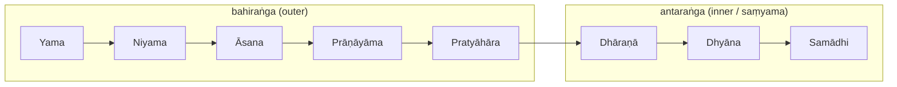

# 🪷 Philosophy & Core Concepts

Strip away the mats and the studios, and yoga is asking a single, audacious question: *why do we suffer, and can it end?* Its answer is stranger and bolder than "relax more." Classical yoga claims that you are not your anxious, churning mind at all — you are the silent awareness *watching* it — and that the whole point of practice is to stop confusing the two. The name for that freedom is **kaivalya**: a clean, final release in which consciousness, having spent a lifetime mistaking the movie for the watcher, finally sits back in its seat. Everything else in this note — the ethics, the breath, the chakras, the dizzying inventory of reality — is scaffolding raised around that one liberating recognition.

The scaffolding comes from three great sources, and it helps to know who supplies what before we climb it. **Sāṃkhya** hands yoga its *map of reality* — the stark division between the watcher (*puruṣa*) and everything watched (*prakṛti*). **Patañjali**, in the *Yoga Sūtras* (c. 2nd–4th c. CE), hands it a *method* — eight practical limbs that carry a person from ordinary distraction all the way to absorption. And later **Tantra** and **Vedānta** re-imagine the *destination* itself, trading isolation for union, and adding the luminous inner geography of subtle bodies, chakras and channels. This note follows that arc: outward from ethics toward absorption, then inward from the gross body toward the witness who was there all along. (For the texts beneath it all, see [[Foundational-Texts]]; for the long historical swing between these schools, [[History-and-Origins]].)

## The eight limbs (aṣṭāṅga) — a journey in stages

Patañjali was, above all, a practical man. He did not expect anyone to leap straight into the silent depths; he built a **ladder**, eight rungs from outer conduct to inner absorption, and insisted you climb it rather than skip it ([Ashtanga — Wikipedia](https://en.wikipedia.org/wiki/Ashtanga_(eight_limbs_of_yoga))). The first five rungs are **bahiraṅga**, the "outer" limbs — they quiet the noise of an unruly life and an unruly body so that something subtler can be heard. The last three are **antaraṅga**, the "inner" limbs, and they are really one continuous act of attention deepening on itself, which Patañjali bundles together under a single name, *saṃyama* — the combined instrument of insight. Read the list less as a checklist than as a story of a mind gradually turning toward home:

1. **Yama** — ethical restraints: how we relate to the world. The journey begins not in the body but in conduct, because a person at war with others can never be at peace alone.
2. **Niyama** — observances: how we relate to ourselves. Once the outer life is in order, attention turns inward to one's own discipline and devotion.
3. **Āsana** — posture. For Patañjali this is no gymnastic feat but *sthira-sukham* — "steady and comfortable" — a seat so effortless the body stops clamouring for attention (the athletic posture-craft most people now call yoga is a later flowering; see [[Practices]]).
4. **Prāṇāyāma** — the regulation of breath, and through it the vital energy that breath carries. Steady the breath and the mind, its restless twin, begins to steady too.
5. **Pratyāhāra** — withdrawal of the senses from their objects: the turning point of the whole climb, where awareness stops leaking outward through the eyes and ears and folds back on itself.
6. **Dhāraṇā** — concentration: "binding consciousness to a single place," the first one-pointed effort, still a little forced.
7. **Dhyāna** — meditation: that effort ripening into an *uninterrupted flow* toward the single point, awareness now without strain.
8. **Samādhi** — absorption, the summit, in which the meditator, the act of meditating, and the object of meditation collapse into one. There is no longer anyone "doing" yoga; there is only the doing.

> [!quote] *Yoga Sūtra* 2.29 — the eight limbs, verbatim
> *yama-niyamāsana-prāṇāyāma-pratyāhāra-dhāraṇā-dhyāna-samādhayo'ṣṭāv aṅgāni*
> — "Yama, Niyama, Âsana, Prânâyâma, Pratyâhâra, Dhârâna, Dhyâna, and Samâdhi
> are the steps in Raja-Yoga."
> — Swami Vivekananda, *Rāja-Yoga* (1896), [Patañjali's Yoga Aphorisms II.29 — Wikisource](https://en.wikisource.org/wiki/The_Complete_Works_of_Swami_Vivekananda/Volume_1/Raja-Yoga/Raja-Yoga_In_Brief) *(public domain)*

Seen as a whole, the climb looks like this — the outer five preparing the ground, the inner three flowing together as a single deepening attention:

> [!tip] Saṃyama
> When dhāraṇā, dhyāna and samādhi are applied **to the same object**, Patañjali
> calls the combination *saṃyama*. It is the engine of yogic insight (*prajñā*) —
> and, in the *Vibhūti Pāda*, the source of the famous yogic powers (*siddhis*),
> which Patañjali then warns are obstacles to the final goal.

### The yamas & niyamas — the ground floor

It is tempting to rush past the first two limbs to get to the "real" yoga of breath and silence, but Patañjali will not let us. The yamas and niyamas are the ethical floor on which the whole edifice stands; he calls the yamas the *mahāvrata*, the "great vow," binding regardless of birth, place, time or circumstance — no exemptions, no special cases ([Yoga Sutras — Wikipedia](https://en.wikipedia.org/wiki/Yoga_Sutras_of_Patanjali)). The logic is quietly ruthless: a mind tangled in cruelty, dishonesty or grasping will never grow quiet enough to meditate. Clean up the life, and the inner work becomes possible. The restraints (*yamas*) point outward, at how we treat the world; the observances (*niyamas*) point inward, at how we tend ourselves:

| Yamas (restraints — outward) | Niyamas (observances — inward) |
|---|---|
| **Ahiṃsā** — non-violence; the root from which the others follow | **Śauca** — cleanliness/purity, of body and mind |
| **Satya** — truthfulness in word and thought | **Santoṣa** — contentment, non-craving for what is absent |
| **Asteya** — non-stealing, including of credit, time, attention | **Tapas** — disciplined heat/austerity that "burns" impurity |
| **Brahmacarya** — moderation; right use of vital (esp. sexual) energy | **Svādhyāya** — self-study & recitation of scripture |
| **Aparigraha** — non-grasping, non-hoarding, non-possessiveness | **Īśvara-praṇidhāna** — surrender/devotion to the divine (*Īśvara*) |

> [!note] Why *Īśvara* in a "godless" system?
> Sāṃkhya is famously non-theistic, yet Patañjali installs **Īśvara** — a special,
> never-bound puruṣa — as an optional focus of devotion and a shortcut to samādhi.
> This is one of yoga's signature departures from strict Sāṃkhya.

## The five kleśas — what binds us

But before we can talk sensibly about freedom, we have to be honest about what holds us captive. Patañjali is unsentimental here: he names five **afflictions**, the *kleśas*, the deep tendencies that manufacture suffering and keep consciousness snared in the mind it watches (*Yoga Sūtra* 2.3 — [The Yoga Institute](https://theyogainstitute.org/5-kleshas-root-causes-of-suffering-in-life)). They are not five separate problems so much as one problem and its four offspring: the first, *avidyā*, is the soil in which the other four take root.

1. **Avidyā** — fundamental *ignorance*: mistaking the impermanent for the permanent, the not-self for the Self. This is the original error, and every other affliction grows from it.
2. **Asmitā** — *egoism*: the precise misstep of confusing pure awareness with the instrument that perceives, taking "I think" to mean "I *am* this thinking."
3. **Rāga** — *attachment*: the pull toward pleasure and the things that gave it.
4. **Dveṣa** — *aversion*: the recoil from pain, surfacing as anger, anxiety, hatred.
5. **Abhiniveśa** — the *clinging to life*, the animal fear of death said to grip even the wise.

Notice the symmetry: ignorance breeds a false self, the false self then reaches for pleasure and shoves away pain, and the whole apparatus white-knuckles its own survival. Yoga does not amputate these — it *thins* them. The disciplines of *kriyā-yoga* (tapas, svādhyāya, īśvara-praṇidhāna — the very niyamas above) gradually wear the afflictions down until the clear seeing of liberation can dissolve what remains.

## Sāṃkhya metaphysics — the great drama of two

To understand why ignorance is so catastrophic — and why freedom is even possible — we have to step back into the worldview Patañjali inherited from **Sāṃkhya**, one of the oldest and most rigorous systems of Indian thought. Its vision is a kind of cosmic drama with only two characters, and the entire human predicament turns on their being mistaken for each other ([Samkhya — Wikipedia](https://en.wikipedia.org/wiki/Samkhya)).

The first character is **puruṣa** — pure, attribute-less **consciousness**, the witness. It does nothing, wants nothing, changes nothing; it simply *sees*. It is uncaused, unchanging, plural (each of us has our own), and never the effect of anything. Think of it as light: it illuminates without itself being touched by what it lights.

The second is **prakṛti** — **primordial nature**, the entire seething field of matter and energy. Here is the twist that surprises every newcomer: prakṛti is *unconscious*, yet it is the source of everything we usually call "mind." Thought, emotion, intellect, the very sense of "I" — all of it unfolds *from* prakṛti, not from puruṣa. The watcher is silent and aware but inert; the watched is active and intricate but blind.

The engine driving prakṛti's endless transformations is a trio of strands, the **three guṇas**, whose shifting balance colours every phenomenon in existence — **sattva** (clarity, harmony, light), **rajas** (activity, passion, motion), and **tamas** (inertia, dullness, mass) ([Yoga International: the gunas](https://yogainternational.com/article/view/the-gunas-natures-three-fundamental-forces/)). When the three rest in equilibrium, nothing manifests; when their balance tips, the whole pageant of the world spins out.

And here is the tragedy at the heart of the system. Pure consciousness, gazing into the most refined, mirror-like layer of prakṛti — the intellect — sees its own reflection there and forgets it is only a reflection. *That* is the primal confusion the kleśas described: the light mistaking itself for the lamp. The mind suffers, and consciousness, identified with the mind, believes it is suffering too — though in truth it was only ever watching.

### The 25 tattvas — how the one becomes the many

Sāṃkhya is nothing if not thorough. It does not just assert that mind unfolds from matter; it *itemises* the unfolding, counting reality in **25 tattvas** ("principles"): puruṣa, unmanifest prakṛti, and the **23 evolutes** that cascade out when the guṇas lose their equilibrium ([24 Tattvas — Hindu Website](https://www.hinduwebsite.com/24principles.asp); [25 Tattvas — Poojn](https://www.poojn.in/post/31559/understanding-the-25-tattvas-in-samkhya-a-clear-explanation)). What makes the list worth lingering on is its direction of travel: it runs *inward to outward*, intellect first and gross matter last — the opposite of the modern materialist instinct. Mind is not built up from atoms here; the world of atoms precipitates *out of* a primordial intelligence.

| # | Tattva(s) | What it is |
|---|---|---|
| 1 | **Puruṣa** | pure consciousness (the witness) — *not* an evolute |
| 2 | **Prakṛti** | unmanifest root-nature (guṇas in equilibrium) |
| 3 | **Mahat / Buddhi** | the "great one" — intellect, discrimination, will |
| 4 | **Ahaṃkāra** | ego-sense; the "I-maker" that branches into the rest |
| 5 | **Manas** | mind; coordinator of sensation and action |
| 6–10 | **Jñānendriyas** | five sense-organs (ear, skin, eye, tongue, nose) |
| 11–15 | **Karmendriyas** | five action-organs (speech, hands, feet, excretion, generation) |
| 16–20 | **Tanmātras** | five subtle elements (sound, touch, form, taste, smell) |
| 21–25 | **Mahābhūtas** | five gross elements (ether, air, fire, water, earth) |

Read the table as a genealogy of experience. The middle players — *mahat*, *ahaṃkāra* and the *tanmātras* — are both causes and effects, each begotten and begetting; the gross elements are effects only, the dead-ends of the cascade; and puruṣa and prakṛti alone stand outside the chain, uncaused. The crucial, freeing point is this: liberation does not mean smashing any of this machinery. The world is not an illusion to be destroyed. Freedom is simply *seeing through* the apparatus — recognising that the watcher was never one of its parts.

### The goal — *kaivalya*, the great unmistaking

Which brings us back to where we began. If suffering is consciousness mistaking itself for the mind, then freedom is the unmistaking — and Sāṃkhya gives it a precise and slightly austere name: **kaivalya**, "aloneness," "isolation." It is the decisive flash of **discernment** (*viveka*) in which puruṣa sees, finally and irreversibly, that it is utterly *separate* from prakṛti, and so stops taking the mind's restless weather for its own ([Samkhya — Wikipedia](https://en.wikipedia.org/wiki/Samkhya)). Nothing is annihilated; the witness simply stops *identifying* with what it watches, and in that letting-go is wholly free.

It is worth pausing on the strangeness of the word. Liberation here is *separation* — standing apart, alone, unentangled. Hold that in mind, because when we reach Tantra and Vedānta the very same destination will be renamed its opposite — **union** — and that single reversal turns out to be the deepest fault-line in the whole tradition.

### The stages of samādhi — the ascent into silence

But how does a person actually *arrive* at that seeing? Not in one leap. The eighth limb, samādhi, is itself a graded ascent — absorption that grows quieter and emptier by stages until even its own object falls away ([Stages of Samadhi — VedicFeed](https://vedicfeed.com/stages-of-samadhi/); [Raja Yoga Samadhi — Divine Life Society](https://www.dlshq.org/discourse/raja-yoga-samadhi/)):

- **Samprajñāta** ("with cognition") — absorption that still has an **object/seed** (*sabīja*). The mind rests on something, refining through grosser-to-subtler supports (*vitarka → vicāra → ānanda → asmitā*). Often equated with **savikalpa** ("with distinction"): a trace of knower/known remains — "Thou and I are One."
- **Asamprajñāta** ("without cognition") — **seedless** (*nirbīja*) absorption; even the subtle object dissolves and all mental modifications (*vṛttis*) finally cease. Equated with **nirvikalpa** ("without distinction"): no remaining split at all between knower, knowing and known. From this stillness — the mind grown utterly transparent — **kaivalya** ripens. The watcher is at last alone with itself.

The two stages sit side by side like this:

| | Samprajñāta / Savikalpa | Asamprajñāta / Nirvikalpa |
|---|---|---|
| Object present? | yes (*sabīja*, seeded) | no (*nirbīja*, seedless) |
| Knower/known split? | a trace remains | fully dissolved |
| Mental modifications | refined, not stopped | wholly stilled |
| Leads to | deepening insight | kaivalya / liberation |

## The subtle body — koshas, bodies & chakras

Patañjali's path is austere, almost monochrome: a lone witness disentangling itself from nature. But the later tradition could not leave the body so empty. Where did all that absorption *happen*? What were the practitioners actually feeling as energy rose, breath stilled, and attention sank inward? Out of those reported experiences grew one of yoga's most vivid contributions — a detailed inner cartography of bodies within the body, wheels of energy along the spine, and rivers of vital force. Before we step into it, one honest caution, because this is exactly where yoga is most often misread:

> [!warning] ⚠️ Read this map as symbolic / experiential
> The chakras, nāḍīs and koshas are a **contemplative and energetic cartography**,
> not anatomy. They do not correspond to nerves, glands or organs, and modern
> attempts to pin chakras onto the endocrine system are interpretive overlays,
> not findings. Treat the whole subtle-body model as a *phenomenology of inner
> experience* — a language for what practitioners report — rather than biomedical fact.

With that held firmly in mind, the map becomes not a pseudo-science but a beautiful and surprisingly precise language for the inner life — and it comes mainly from **Tantra** and **Vedānta** (for how this geography is actually *worked* in practice, see [[Practices]]). For centuries practitioners drew it as lovingly as European anatomists drew the body, as in this figure:

*"Sapta Chakra," from a Yoga manuscript in Braj Bhāṣā, 1899 (British Library). Via [Wikimedia Commons](https://commons.wikimedia.org/wiki/File:Sapta_Chakra,_1899.jpg). **Public domain** (faithful reproduction of a 2-D work whose copyright has expired). ⚠️ A symbolic cartography, not anatomy.*

### Three bodies (śarīra-traya) & five koshas

Vedānta's picture of the self is like an onion, or a set of nested Russian dolls. The being you call "you" is wrapped in **three bodies** — gross, subtle and causal — which in turn correspond to **five sheaths** (*pañca-kosha*), each more refined than the last, each a layer closer to the silent core ([Three Bodies — Prana Sutra](https://www.prana-sutra.com/post/sthula-sukshma-karana-sharira); [Sharira Traya — Dharmawiki](https://dharmawiki.org/index.php/Sharira_Traya_(%E0%A4%B6%E0%A4%B0%E0%A5%80%E0%A4%B0%E0%A4%A4%E0%A5%8D%E0%A4%B0%E0%A4%AF%E0%A4%AE%E0%A5%8D))):

| Body (śarīra) | Contains kosha(s) | "Sheath of…" |
|---|---|---|
| **Sthūla** (gross) | Annamaya | food / the physical body |
| **Sūkṣma** (subtle) ⚠️ | Prāṇamaya | vital energy (breath, nāḍīs) |
| | Manomaya | mind (thought, emotion) |
| | Vijñānamaya | wisdom / discernment |
| **Kāraṇa** (causal) ⚠️ | Ānandamaya | bliss; nearest the Self |

The point of the scheme is that none of these sheaths is the Self — they are all *coverings* over it. So the contemplative works inward by subtraction, the famous *neti, neti*, "not this, not this": I am not this food-built body, not this breath, not these thoughts, not even this discerning wisdom or this bliss — peeling away each layer until only the witness is left, unwrapped. The causal body, subtlest and deepest, is the seed of the other two and the very last to fall away. (You may notice the family resemblance to Sāṃkhya's witness shedding prakṛti; the destinations differ, but the gesture of *disidentification* is the same.)

### The chakras — wheels along the central channel

Within that subtle body runs the most celebrated feature of the inner map: seven principal **chakras** (*cakra*, "wheel"), spinning energy-centres threaded like beads along the central channel, the **suṣumnā**. They are said to lie dormant until **kuṇḍalinī** — a coiled, latent energy at the base of the spine, often imagined as a sleeping serpent — awakens and rises through them toward the crown, rousing each in turn ([Chakra names — Kathleen Karlsen](https://kathleenkarlsen.com/chakra-names/); [7 Chakras Chart — Arogya](https://www.arogyayogaschool.com/blog/7-chakras-chart/)). Each wheel carries its own meaning, element and seed-sound (*bīja*). ⚠️ Remember the caution above: the "locations" are **felt, symbolic** loci along the spinal axis — a geography of inner experience, not a chart of organs.

| Chakra | Meaning | Location (symbolic) | Element | Bīja |
|---|---|---|---|---|
| **Mūlādhāra** (root) | "root support" | base of spine / perineum | earth | LAṂ |
| **Svādhiṣṭhāna** (sacral) | "one's own abode" | lower abdomen / sacrum | water | VAṂ |
| **Maṇipūra** (solar plexus) | "city of jewels" | navel / upper abdomen | fire | RAṂ |
| **Anāhata** (heart) | "unstruck" (sound) | centre of the chest | air | YAṂ |
| **Viśuddha** (throat) | "especially pure" | throat | ether/space | HAṂ |
| **Ājñā** (third eye) | "command / perceive" | between the eyebrows | mind/light | OṂ |
| **Sahasrāra** (crown) | "thousand-petalled" | crown of the head | beyond elements | (silent / AḤ) |

### The three principal nāḍīs — the rivers that feed the wheels

If the chakras are stations, the **nāḍīs** are the rivers between them — thousands of "channels" through which **prāṇa**, the vital current, flows. Of all of them three matter most, and their interplay is the quiet drama behind every breathing practice ([The Three Nadis — Fitsri](https://www.fitsri.com/yoga/nadis); [Subtle channels — Ekhart Yoga](https://www.ekhartyoga.com/articles/practice/subtle-energy-channels-kundalini-sushumna-ida-pingala)). ⚠️ Once more: these are experiential currents, not the physical spinal cord or autonomic nerves they are sometimes loosely compared to.

- **Iḍā** — the left-hand, "lunar" channel: cooling, receptive, mind-quieting.
- **Piṅgalā** — the right-hand, "solar" channel: warming, active, the energising outward drive.
- **Suṣumnā** — the **central** channel running up the spinal axis, and the one that matters most. It stays shut while the lunar and solar currents pull a person between calm and agitation; only when iḍā and piṅgalā come into **balance** does suṣumnā open — and through that opened middle road kuṇḍalinī can finally ascend, chakra by chakra, toward the thousand-petalled crown.

*A meditating yogin with the chakras strung along the central channel; manuscript painting (pre-1931), Wellcome Collection. Via [Wikimedia Commons](https://commons.wikimedia.org/wiki/File:Yogin_in_meditation_chakras_kundalini_snake.jpg). **Public domain** (original work + faithful reproduction). ⚠️ Felt/symbolic loci, not organs.*

> [!quote] *Ṣaṭ-cakra-nirūpaṇa* v. 1 — suṣumnā between the moon and sun channels
> "In the space outside the Meru, placed on the left and the right, are the two Sirās,
> Sasi and Mihira [moon = **Iḍā**, sun = **Piṅgalā**]. The Nāḍī Suṣumnā, whose substance
> is the threefold Guṇas, is in the middle."
> — Pūrṇānanda's *Ṣaṭ-cakra-nirūpaṇa*, trans. Arthur Avalon (Sir John Woodroffe), *The Serpent Power* (1919), [full text — Internet Archive](https://archive.org/stream/TheSerpentPowerByArthurAvalon/The+Serpent+Power+by+Arthur+Avalon_djvu.txt) *(public domain; translation copyright expired)*

> [!note] Koshas vs. chakras vs. nāḍīs
> Easy to conflate, but: **koshas** = nested *layers* over the Self; **chakras** =
> *centres* within the subtle body; **nāḍīs** = *channels* connecting them. Different
> geometries of the same inner cartography.

## Three goals, three reframings

We can now close the circle we opened. The same eight-limbed practice, the same map of bodies and channels, can point at strikingly different destinations depending on who is walking the path — and the differences are not quibbles but three distinct visions of what freedom even *is* ([Reconciling Samkhya, Vedanta & Tantra — Auromere](https://auromere.wordpress.com/2012/09/28/reconciling-samkhya-vedanta-and-tantra/); [Nondualism — Wikipedia](https://en.wikipedia.org/wiki/Nondualism)):

- **Classical Yoga / Sāṃkhya** seeks **kaivalya**, *isolation*. Spirit and matter are ultimately two, forever; liberation is the clean disentangling of puruṣa from prakṛti, the witness abiding serenely alone. This is the vision the whole note has followed.
- **Vedānta** (above all Advaita) seeks **mokṣa as non-duality**, captured in three words: *Ātman = Brahman*. Here there is no second thing to be isolated *from*. The "union" is not an achievement but a *recognition* — that the individual self was never, even for an instant, separate from the absolute. The separation was the illusion all along.
- **Tantra** seeks **embodied union**. Spirit (Śiva) and energy (Śakti) are not enemies to be parted but two faces of one reality. So rather than fleeing the body and the world, the tantric practitioner *transfigures* them — kuṇḍalinī rising to wed Śakti to Śiva at the crown. Liberation is found not by escaping the body but right inside it.

> [!tip] One word, two directions
> "Yoga" can mean **separation** (Sāṃkhya: severing puruṣa from prakṛti) *or*
> **union** (Tantra/Vedānta: yoking self to absolute). The history of the tradition
> is largely the swing between these poles — see [[History-and-Origins]].

## Related
- The texts this comes from → [[Foundational-Texts]] (the *Yoga Sūtras*, Upaniṣads, tantric corpus)
- How the subtle body is *worked* → [[Practices]]
- The historical arc, Sāṃkhya → Tantra → modern → [[History-and-Origins]]

## Sources
- [Ashtanga (eight limbs) — Wikipedia](https://en.wikipedia.org/wiki/Ashtanga_(eight_limbs_of_yoga))
- [Yoga Sutras of Patanjali — Wikipedia](https://en.wikipedia.org/wiki/Yoga_Sutras_of_Patanjali)
- [8 Limbs of Yoga — Yoga Journal](https://www.yogajournal.com/yoga-101/philosophy/8-limbs-of-yoga/eight-limbs-of-yoga/)
- [The 5 Kleshas — The Yoga Institute](https://theyogainstitute.org/5-kleshas-root-causes-of-suffering-in-life)
- [Samkhya — Wikipedia](https://en.wikipedia.org/wiki/Samkhya)
- [24 Tattvas of Samkhya — Hindu Website](https://www.hinduwebsite.com/24principles.asp)
- [Understanding the 25 Tattvas — Poojn](https://www.poojn.in/post/31559/understanding-the-25-tattvas-in-samkhya-a-clear-explanation)
- [The Gunas — Yoga International](https://yogainternational.com/article/view/the-gunas-natures-three-fundamental-forces/)
- [Stages of Samadhi — VedicFeed](https://vedicfeed.com/stages-of-samadhi/)
- [Raja Yoga Samadhi — Divine Life Society](https://www.dlshq.org/discourse/raja-yoga-samadhi/)
- [Koshas — Healthline](https://www.healthline.com/health/mental-health/koshas)
- [Three Bodies (Sthula/Sukshma/Karana) — Prana Sutra](https://www.prana-sutra.com/post/sthula-sukshma-karana-sharira)
- [Sharira Traya — Dharmawiki](https://dharmawiki.org/index.php/Sharira_Traya_(%E0%A4%B6%E0%A4%B0%E0%A5%80%E0%A4%B0%E0%A4%A4%E0%A5%8D%E0%A4%B0%E0%A4%AF%E0%A4%AE%E0%A5%8D))
- [Sanskrit Chakra Names — Kathleen Karlsen](https://kathleenkarlsen.com/chakra-names/)
- [7 Chakras Chart — Arogya Yoga School](https://www.arogyayogaschool.com/blog/7-chakras-chart/)
- [The Three Nadis (Ida, Pingala, Sushumna) — Fitsri](https://www.fitsri.com/yoga/nadis)
- [Subtle energy channels — Ekhart Yoga](https://www.ekhartyoga.com/articles/practice/subtle-energy-channels-kundalini-sushumna-ida-pingala)
- [Reconciling Samkhya, Vedanta & Tantra — Auromere](https://auromere.wordpress.com/2012/09/28/reconciling-samkhya-vedanta-and-tantra/)
- [Nondualism — Wikipedia](https://en.wikipedia.org/wiki/Nondualism)

### Canonical texts & images (open-licence)
- *Yoga Sūtra* 2.29 — Vivekananda, *Rāja-Yoga* (1896), public domain → [Wikisource](https://en.wikisource.org/wiki/The_Complete_Works_of_Swami_Vivekananda/Volume_1/Raja-Yoga/Raja-Yoga_In_Brief)
- *Ṣaṭ-cakra-nirūpaṇa* v. 1 — Avalon, *The Serpent Power* (1919), public domain → [Internet Archive full text](https://archive.org/stream/TheSerpentPowerByArthurAvalon/The+Serpent+Power+by+Arthur+Avalon_djvu.txt)
- Image: *Sapta Chakra, 1899* (British Library, Braj Bhāṣā Yoga manuscript) — public domain → [Wikimedia Commons](https://commons.wikimedia.org/wiki/File:Sapta_Chakra,_1899.jpg)
- Image: *Yogin in meditation* (Wellcome Collection manuscript painting) — public domain → [Wikimedia Commons](https://commons.wikimedia.org/wiki/File:Yogin_in_meditation_chakras_kundalini_snake.jpg)
